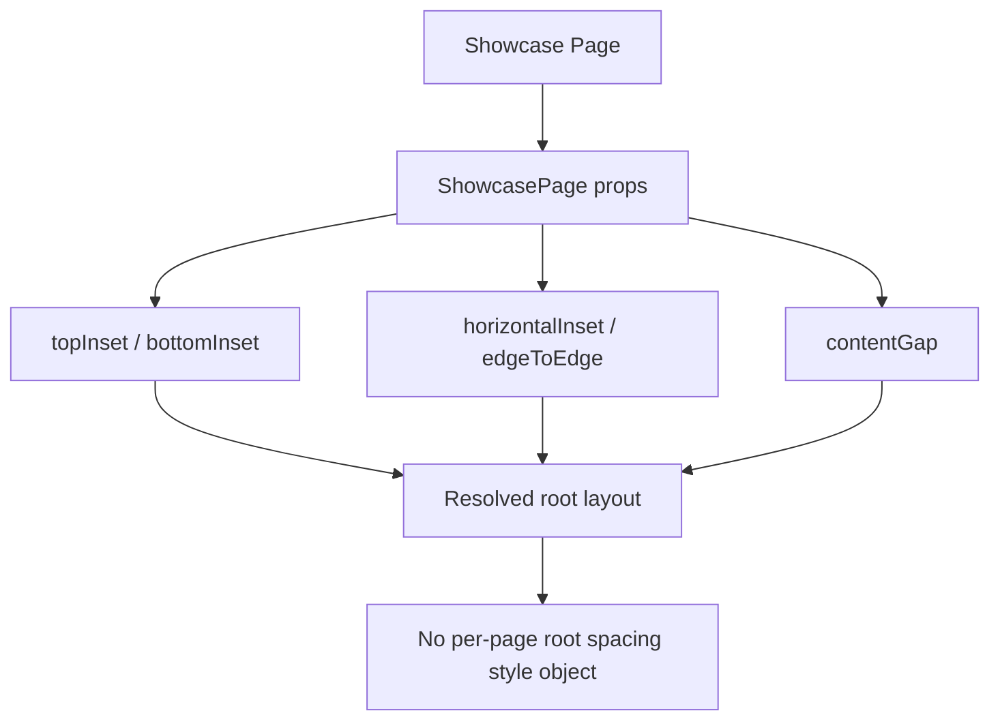

# Showcase Layout Attempt 4

## Goal

Remove remaining root spacing style objects from showcase pages and encode spacing only through `ShowcasePage` props.

## What Was Unified

- Replaced `contentContainerStyle={styles.scrollContent|s.root|styles.contentContainer}` root spacing usage across showcase pages with:
  - `topInset`
  - `bottomInset`
  - `horizontalInset`
  - `contentGap`
  - `edgeToEdge`
- Deleted now-unused root spacing style keys (`root`, `scrollContent`, `contentContainer`) from those pages.
- Kept `contentContainerStyle` only where it still carries root background color (non-spacing concern).

## Result

- Root spacing is now declarative and centralized in one component API.
- Showcase pages no longer maintain duplicate root spacing style objects.
- The next and final layout cleanup is to replace background-color container style objects with a semantic `ShowcasePage` background prop.

## Diagram

