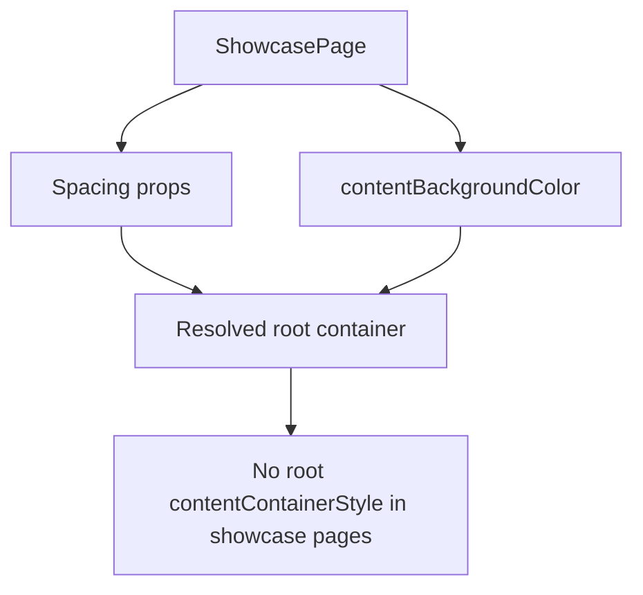

# Showcase Layout Attempt 5

## Goal

Eliminate the last root `contentContainerStyle` usage in showcase pages by centralizing root background fill in `ShowcasePage`.

## What Was Unified

- Added `contentBackgroundColor` to `ShowcasePage`.
- Applied the new prop in all showcase pages that used root `contentContainerStyle` only for background color.
- Removed remaining `contentContainerStyle` usage from all showcase page roots.

## Result

- `ShowcasePage` now owns root spacing and root background concerns.
- Showcase pages express layout as intent-only props.
- Root container setup across showcase pages is maximally simple and composable.

## Diagram

