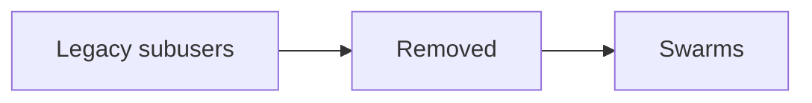

# Subusers (Retired)

The dedicated subuser runtime and tools have been removed.

Use swarms for isolated, owner-created worker identities:
- [Swarms concept](concepts/swarms.md)
- `swarm_create`
- `send_user_message({ nametag, ... })`

