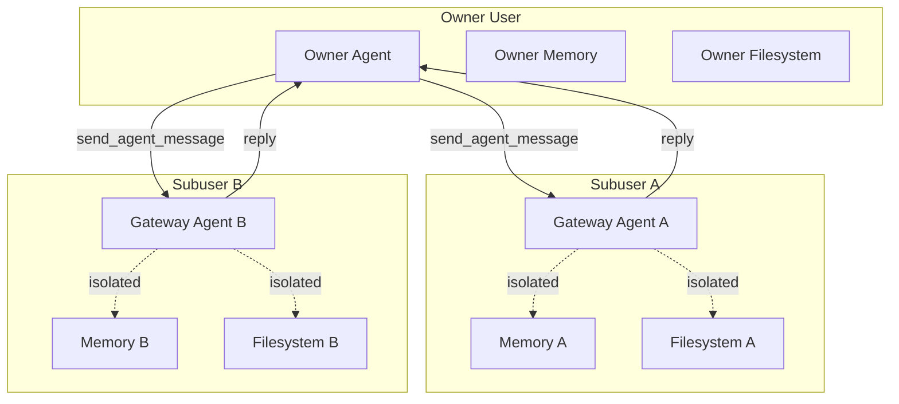
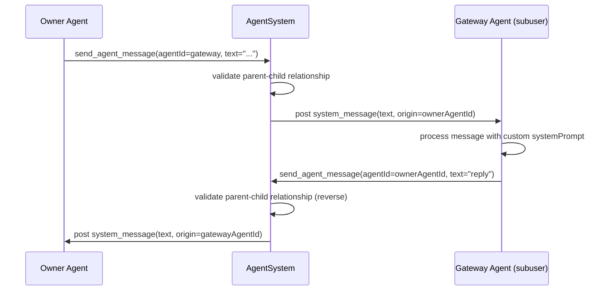

# Subusers

Subusers provide complete isolation between logical applications sharing the same Daycare instance. Each subuser gets its own memory, filesystem, sandbox, and agent scope while remaining controllable by the owner.

## Concepts

A **subuser** is a child user created by the owner. It has:
- Its own `userId` (separate from the owner)
- Its own memory graph at `<usersDir>/<subuserId>/memory/graph/`
- Its own filesystem sandbox via `UserHome`
- A single **gateway agent** that receives messages from owner agents

The **gateway agent** is an agent with descriptor type `subuser`. It runs with the subuser's identity and has a configurable system prompt that defines its behavior.

## Architecture



## Message Flow



## Tools

### `subuser_create`

Creates a new subuser with a gateway agent. Only the owner can call this.

**Parameters:**
- `name` (string): Display name for the subuser
- `systemPrompt` (string): System prompt for the gateway agent

**Returns:** `{ subuserId, gatewayAgentId, name }`

### `subuser_configure`

Updates the gateway agent's system prompt. Only the owner can call this.

**Parameters:**
- `subuserId` (string): The subuser's ID
- `systemPrompt` (string): New system prompt for the gateway agent

**Returns:** `{ subuserId, gatewayAgentId }`

### `subuser_list`

Lists all subusers and their gateway agents. Only the owner can call this.

**Parameters:** none

**Returns:** `{ summary, count }`

## Isolation Boundaries

| Resource | Scope |
|----------|-------|
| Memory graph | Per-user (`<usersDir>/<userId>/memory/graph/`) |
| Filesystem | Per-user via `UserHome` |
| Agents | Filtered by `userId` in topology |
| Cron tasks | Filtered by `userId` |
| Heartbeats | Filtered by `userId` |
| Channels | Filtered by agent membership |
| Signals | Filtered by `userId` (already was) |
| Expose endpoints | Filtered by `userId` |

## Cross-User Messaging

The `send_agent_message` tool validates cross-user messaging boundaries. Only parent-child user relationships are allowed:
- Owner agent can message subuser's gateway agent
- Gateway agent can reply back to the owner agent that messaged it
- Messaging between unrelated users is rejected

## Topology Visibility

- **Owner agents** see all agents (including subuser gateways) and a `## Subusers` section listing each subuser with gateway agent info
- **Subuser agents** see only agents belonging to their own `userId`; cron, heartbeat, channel, and expose sections are also filtered

## Database Schema

The users table has two additional columns:

```sql
ALTER TABLE users ADD COLUMN parent_user_id TEXT REFERENCES users(id);
ALTER TABLE users ADD COLUMN name TEXT;
CREATE INDEX idx_users_parent ON users(parent_user_id) WHERE parent_user_id IS NOT NULL;
```

## Agent Descriptor

The `subuser` descriptor type:

```typescript
{
    type: "subuser";
    id: string;       // matches the subuser's userId
    name: string;
    systemPrompt: string;
}
```

The `id` field links the gateway agent to its subuser. This is used for:
- Resolving the agent's `userId` (for scoping memory, filesystem, etc.)
- Finding the gateway agent when configuring or listing subusers
