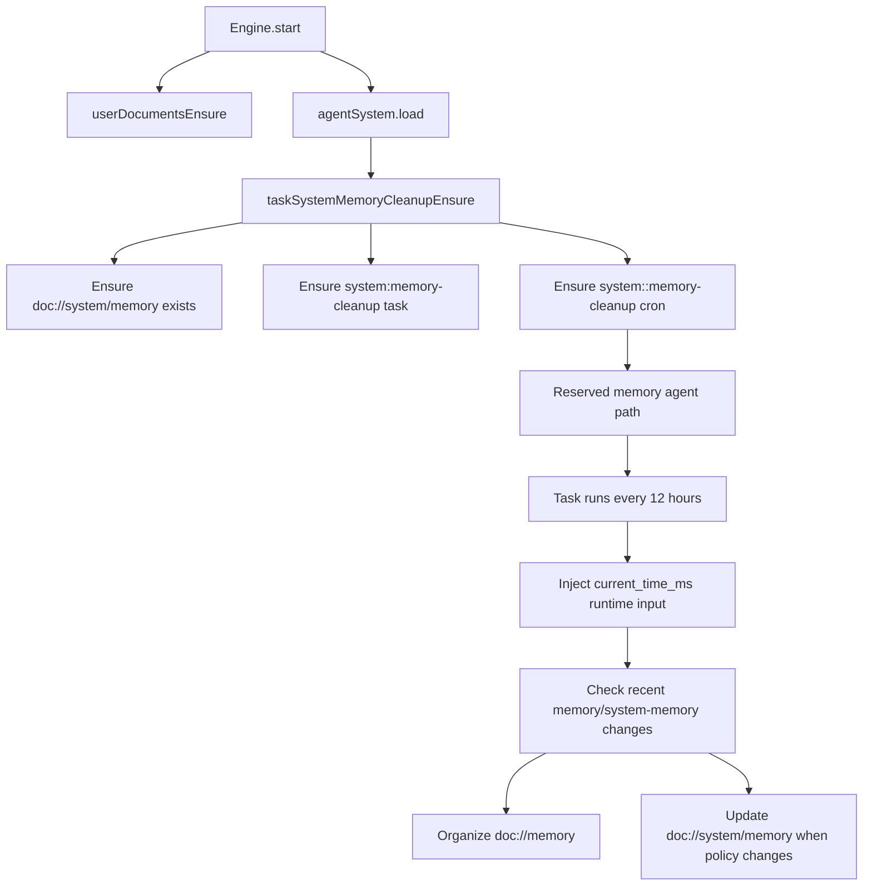

# System Memory Cleanup Automation

Daycare now provisions memory maintenance as a reserved persisted automation instead of an ad-hoc background agent.

## What Exists

- `doc://system/memory` stores durable policy for memory cleanup and compression.
- `system:memory-cleanup` is a reserved persisted task that prepares the maintenance prompt.
- `system:<userId>:memory-cleanup` is a reserved cron trigger that runs every 12 hours.
- The trigger targets a reserved memory agent path so the run can maintain `doc://memory/*` and update `doc://system/memory`.

## Startup Reconciliation

- On engine startup, Daycare ensures the task exists for memory-enabled users.
- If the bundled task definition changes, the persisted system task is refreshed.
- The system cron is created or updated to point at the reserved memory agent.
- If workspace memory is disabled, the system cron is disabled instead of deleted.

## Mutability Rules

- System tasks cannot be updated or deleted through task mutation APIs.
- System triggers cannot be added or removed manually.
- Cron triggers can still be enabled or disabled through trigger update APIs.

- The cron scheduler injects `current_time_ms` at runtime for system tasks so the Monty task can evaluate the 12-hour window without importing unsupported Python stdlib modules.
- The package build copies `sources/system-tasks` into `dist/system-tasks`, so built installs can reconcile system tasks on startup.
