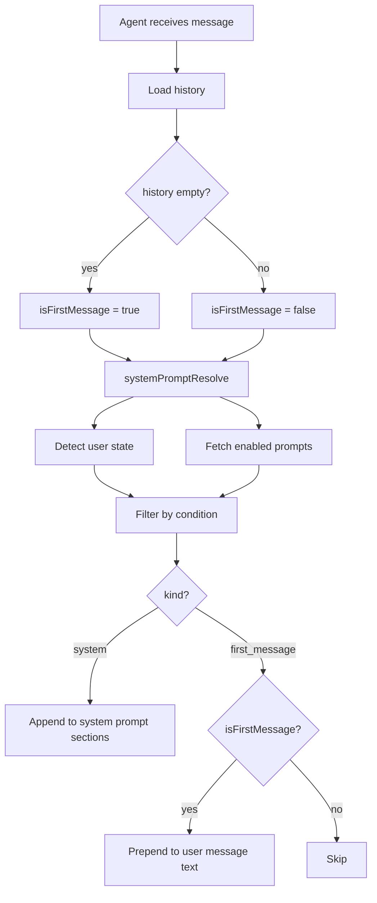

# System Prompts

Configurable prompts that are dynamically injected into agent conversations based on scope, kind, and user state.

## Prompt Types

### System Prompts (`kind: "system"`)
Appended as extra sections to the agent's system prompt. Multiple system prompts are each added as separate sections.

### First Message Prompts (`kind: "first_message"`)
Prepended to the text of the user's very first message in a conversation. Multiple first message prompts are concatenated with newlines. A `firstMessagePrepended` flag is stored in the history record so the original message can be reconstructed.

## Scope

- **Global** (`scope: "global"`) — applies to all users
- **Per-user** (`scope: "user"`, `userId: "<id>"`) — applies only to the specified user

## Conditions

Prompts can optionally target specific user states:

- **Always** (`condition: null`) — always included when scope matches
- **New user** (`condition: "new_user"`) — only for users classified as new
- **Returning user** (`condition: "returning_user"`) — only for users classified as returning

## User State Detection

Users are classified into three states:

| State | Criteria |
|-------|----------|
| `new_user` | Account < 7 days old AND no compacted sessions |
| `returning_user` | Has agents AND last activity > 3 days ago |
| `active_user` | Everything else |

Compaction refers to session `invalidatedAt` being set, indicating the user has had enough conversation history to trigger context compaction.

## Resolution Flow



## Storage

Prompts are stored in the `system_prompts` SQLite table:

```sql
CREATE TABLE system_prompts (
    id TEXT PRIMARY KEY,
    scope TEXT NOT NULL,       -- 'global' | 'user'
    user_id TEXT,              -- NULL for global
    kind TEXT NOT NULL,        -- 'system' | 'first_message'
    condition TEXT,            -- NULL | 'new_user' | 'returning_user'
    prompt TEXT NOT NULL,
    enabled INTEGER NOT NULL DEFAULT 1,
    created_at INTEGER NOT NULL,
    updated_at INTEGER NOT NULL
);
```

## API Endpoints

| Method | Path | Description |
|--------|------|-------------|
| GET | `/v1/engine/system-prompts` | List all prompts |
| GET | `/v1/engine/system-prompts/:id` | Get single prompt |
| POST | `/v1/engine/system-prompts` | Create prompt |
| PUT | `/v1/engine/system-prompts/:id` | Update prompt |
| DELETE | `/v1/engine/system-prompts/:id` | Delete prompt |

## Dashboard

The `/prompts` page in the dashboard provides a UI for managing system prompts with create, edit, delete, and enable/disable functionality.

## Key Files

- `sources/storage/systemPromptsRepository.ts` — CRUD repository
- `sources/engine/agents/ops/userStateDetect.ts` — user state classification
- `sources/engine/agents/ops/systemPromptResolve.ts` — prompt resolution logic
- `sources/engine/agents/ops/agentSystemPrompt.ts` — system prompt builder (accepts `extraSections`)
- `sources/engine/agents/agent.ts` — pipeline integration in `handleMessage()`
- `sources/engine/ipc/server.ts` — API endpoints
- `packages/daycare-dashboard/app/prompts/page.tsx` — dashboard UI
