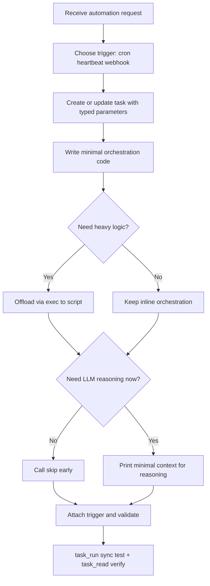

# Task Creation Skill

## Summary

Added a new core skill at `packages/daycare/sources/skills/task-creation/SKILL.md`.
The skill is sandboxed (`sandbox: true`) so it runs asynchronously in a subagent and focuses on robust task authoring:

- minimal Python orchestration
- offloading complex logic through `exec`
- strict `allowedDomains` usage for networked commands
- runtime `json_parse` / `json_stringify` for safe JSON handling in task Python
- aggressive `skip()` usage for no-op and mechanical runs
- clear trigger selection and validation workflow

## Flow

