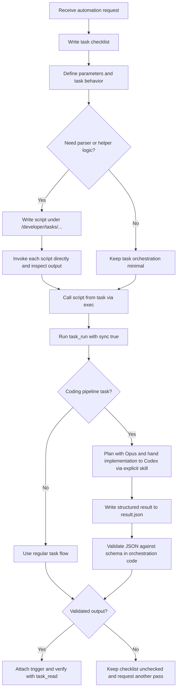

# Task Creation Skill

## Summary

Updated the core task-authoring skill at `packages/daycare/sources/skills/autonomous-ai-agents/tasks-creator/SKILL.md`.
The skill is sandboxed (`sandbox: true`) so it runs asynchronously in a subagent and now focuses on checkmark-based task development and robust task authoring:

- explicit build checklist with direct script verification before triggers
- minimal Python orchestration
- offloading complex logic through `exec`
- script-first website parsing and scraping
- runtime `json_parse` / `json_stringify` for safe JSON handling in task Python
- aggressive `skip()` usage for no-op and mechanical runs
- skill-based model handoffs for coding workflows
- Opus planning/orchestration followed by Codex implementation for coding pipelines
- JSON file handoffs between coding models with schema validation in the orchestrator
- clear trigger selection and validation workflow

## Flow

```mermaid
flowchart TD
    A[Receive automation request] --> B[Write task checklist]
    B --> C[Define parameters and task behavior]
    C --> D{Need parser or helper logic?}
    D -- Yes --> E[Write script under /developer/tasks/...]
    D -- No --> F[Keep task orchestration minimal]
    E --> G[Invoke each script directly and inspect output]
    G --> H[Call script from task via exec]
    F --> H
    H --> I[Run task_run with sync true]
    I --> J{Coding pipeline task?}
    J -- Yes --> K[Plan with Opus and hand implementation to Codex via explicit skill]
    J -- No --> L[Use regular task flow]
    K --> M[Write structured result to result.json]
    M --> N[Validate JSON against schema in orchestration code]
    L --> O{Validated output?}
    N --> O
    O -- Yes --> P[Attach trigger and verify with task_read]
    O -- No --> Q[Keep checklist unchecked and request another pass]
```
