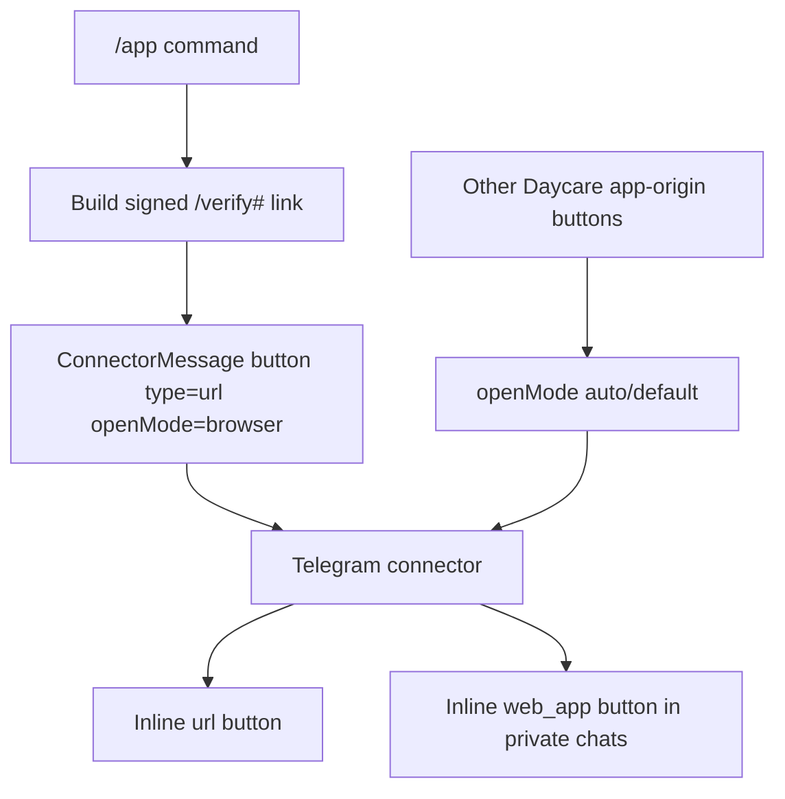

# Telegram /app Browser Links

The `/app` slash command should open the signed Daycare auth link as a normal URL, even in Telegram private chats where Daycare-origin links usually become Mini App buttons.

## Change

- Added an optional `openMode` field to connector URL buttons.
- Telegram keeps the existing automatic `web_app` conversion for Daycare-origin links when `openMode` is unset or `"auto"`.
- The `/app` command now sets `openMode: "browser"` so its `/verify#...` auth link stays a normal URL button.

