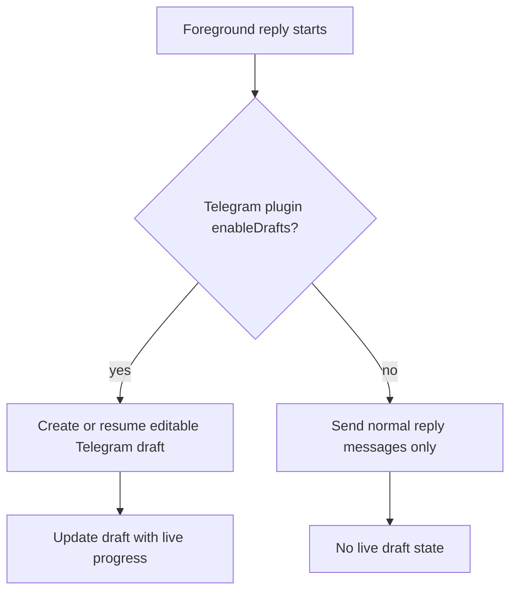

# Telegram Drafts Feature Flag

Telegram live drafts now default to off.

- Telegram connector drafts are gated by the `plugins[].settings.enableDrafts` Telegram plugin setting.

```mermaid
flowchart TD
    A[Foreground reply starts] --> B{Telegram plugin enableDrafts?}
    B -- yes --> C[Create or resume editable Telegram draft]
    B -- no --> D[Send normal reply messages only]
    C --> E[Update draft with live progress]
    D --> F[No live draft state]
```
