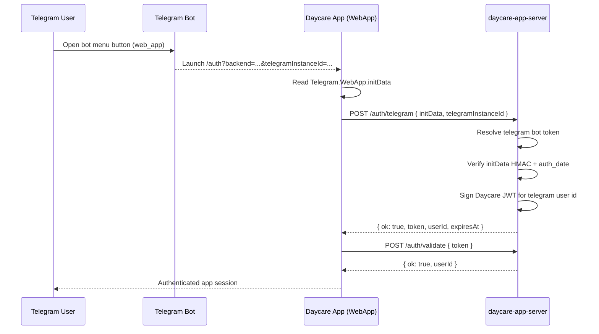

# Telegram WebApp Authentication

This change adds Telegram WebApp authentication support across:

- `packages/daycare/sources/plugins/daycare-app-server`
- `packages/daycare/sources/plugins/telegram`
- `packages/daycare-app/sources/modules/auth` and auth screen routing

## What changed

- Added `POST /auth/telegram` in app-server plugin:
  - Validates Telegram WebApp `initData` signature using the Telegram bot token.
  - Checks `auth_date` freshness.
  - Issues standard Daycare JWT for the resolved Telegram user id.
- Added Telegram auth exchange flow in app frontend:
  - Reads `backend` and `telegramInstanceId` from URL query params.
  - Reads `Telegram.WebApp.initData` from WebApp runtime.
  - Exchanges `initData` via `/auth/telegram`, then logs in with returned token.
- Added Telegram bot menu WebApp integration:
  - When `daycare-app-server` is enabled, Telegram connector sets chat menu button to `web_app`.
  - URL points to `/auth` with query params needed by the app (`backend`, `telegramInstanceId`).
  - Without app-server, menu button remains default commands mode.

