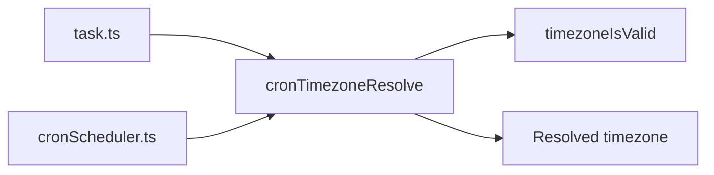
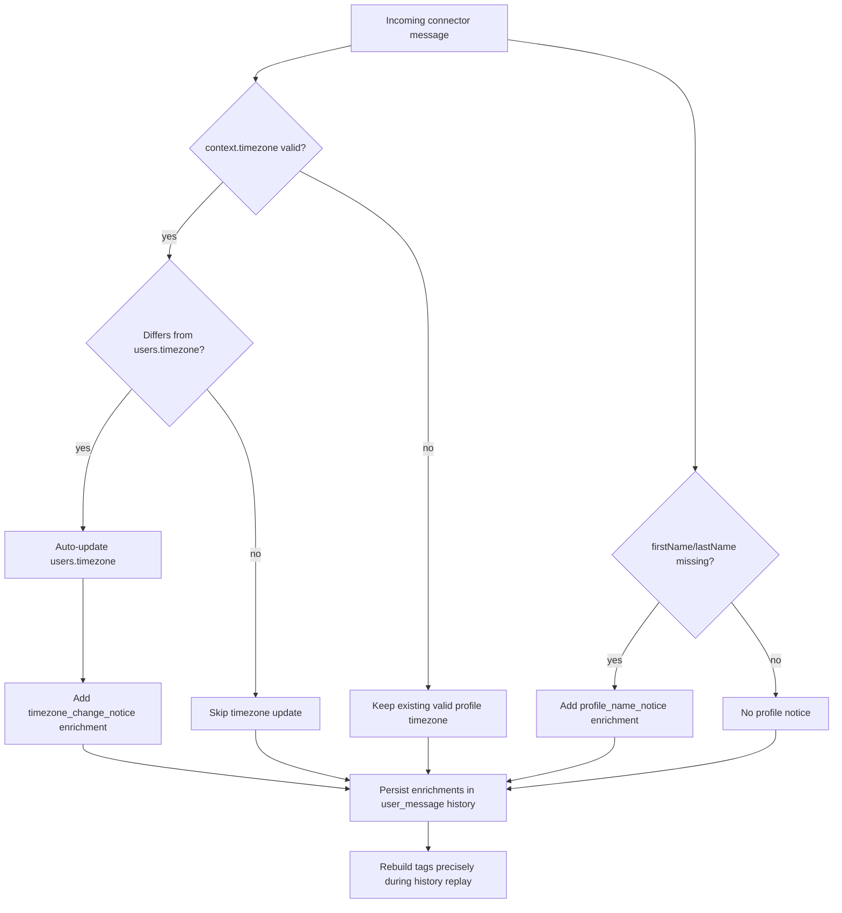

# Timezone Propagation Across Profile, Messages, and Cron

## What changed

- Added `timezone` to user profile storage and `user_profile_update` tool.
- Added timezone metadata to connector/system message context and incoming message formatting.
- Added timezone-aware cron triggers (`tasks_cron.timezone`) with profile-based defaults.
- Added timezone to system prompt environment identity section.

## Runtime flow

```mermaid
flowchart TD
    A[user_profile_update] --> B[users.timezone]
    B --> C[Engine message context enrichment]
    C --> D[messageFormatIncoming]
    D --> E[Formatted tags: timezone + time + message_id]

    B --> F[task_trigger_add/task_create]
    F --> G[tasks_cron.timezone]
    G --> H[CronScheduler]
    H --> I[cronTimeGetNext(schedule, timezone)]
    H --> J[system_message context.timezone]

    B --> K[agentSystemPromptSectionEnvironment]
    K --> L[SYSTEM_ENVIRONMENT.md Identity section]
```

## Cron timezone resolution rules

- If a cron timezone is provided explicitly, it must be a valid IANA timezone.
- If omitted, cron defaults to the user profile timezone when present and valid.
- If no profile timezone exists, cron falls back to `UTC`.

## Shared timezone helpers

- Extracted `timezoneIsValid()` to `sources/util/timezoneIsValid.ts`.
- Extracted cron fallback logic to `sources/engine/cron/ops/cronTimezoneResolve.ts`.
- `CronScheduler` and task tools now use the same resolver to avoid drift.



## Connector timezone sync

- Incoming connector timezone is compared with `users.timezone` from profile.
- When values differ, runtime updates `users.timezone` automatically and emits a context enrichment notice.
- When user names are missing, runtime emits a profile-name context enrichment notice.
- Enrichments are stored as structured `{ key, value }` entries in message context and persisted in history records.
- Invalid incoming/profile timezone strings are ignored.



## Strict timezone requirement for cron tool calls

- `task_create` and `task_trigger_add` now require resolvable timezone:
  - explicit timezone argument, or
  - valid profile timezone.
- If neither exists, tool call throws and the model must ask user for timezone.
