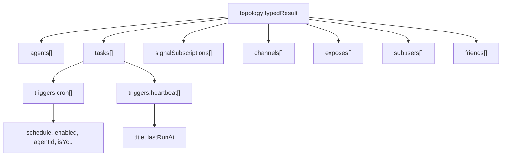

# Topology Structured Return

## Summary

The `topology` tool now returns a structured object as `typedResult` instead of a human-formatted section string.

The result is task-centric:

- `tasks[]` is the primary scheduling view.
- Each task contains nested `triggers.cron[]` and `triggers.heartbeat[]`.
- Internal memory agents and `dead` lifecycle agents are excluded by default.

## Data Shape

## Notes

- `toolMessage.content` contains JSON text for compatibility, but the canonical payload is the structured `typedResult` object.
- Topology enforces task/trigger integrity: if a trigger references a missing task in caller scope, the tool fails.
