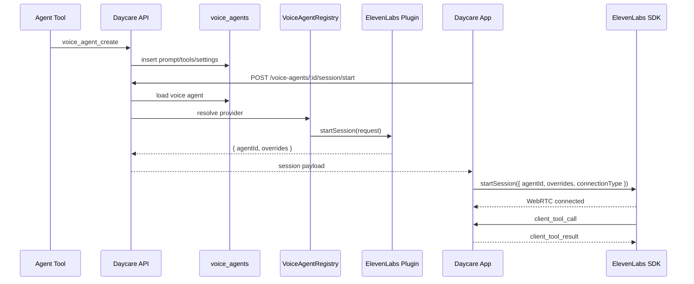

# Voice Agents

Voice agents add a dedicated realtime voice entity to Daycare. They are stored separately from text agents and use
the ElevenLabs Conversational AI stack for call bootstrap, while the app owns the live WebRTC session and client-tool
execution.

## Architecture

- `voice_agents` stores prompt, description, tool definitions, provider settings, and timestamps
- `VoiceAgentRegistry` mirrors the existing speech and inference provider registries
- The ElevenLabs plugin registers both a speech provider and a voice-agent provider
- `POST /voice-agents/:id/session/start` resolves the stored agent, selects a voice provider, and returns
  `{ agentId, overrides }`
- The app calls the ElevenLabs React Native SDK with that session payload and executes client tools locally
- The built-in `voice_agent_create` tool lets other agents create voice agents through storage
- Load the `voice-agents-creator` skill when you want the hidden-by-default `voice_agent_create` tool documented in-prompt
- The app now supports voice calls on both native and web; web uses the ElevenLabs React SDK and starts after a user-triggered microphone permission grant

## Data Model

`voice_agents` is user-scoped and non-versioned:

- `id`
- `user_id`
- `name`
- `description`
- `system_prompt`
- `tools`
- `settings`
- `created_at`
- `updated_at`

## App Notes

- The app adds a dedicated Voice screen and call route under `/{workspace}/voice`
- Native builds use `@elevenlabs/react-native` and LiveKit/WebRTC dependencies
- Web keeps the route available but renders a native-only fallback message instead of trying to start a call
