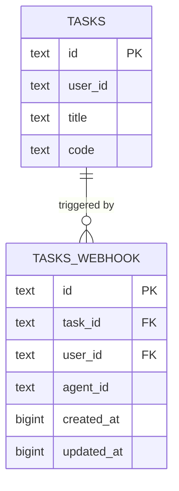
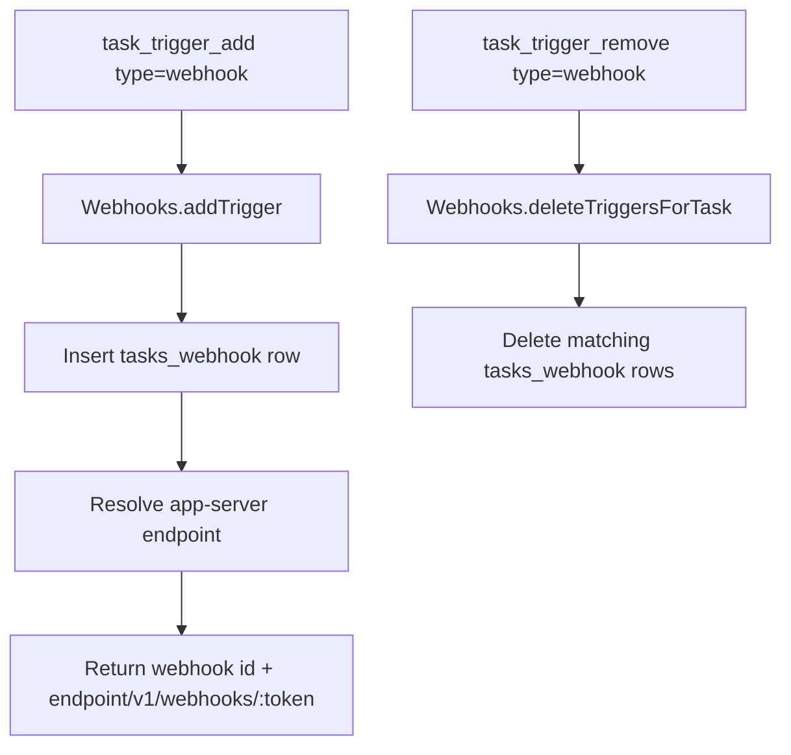

# Webhook Triggers

Webhook triggers add a third task trigger mode (with cron and heartbeat).
Each webhook trigger stores a cuid2 id internally, while external endpoints use a signed token that embeds that id.
Token signing uses the shared auth seed (`auth.json` key `seed`) with a dedicated webhook service scope.

## What Was Added

- `tasks_webhook` storage table and migration (`20260227_webhook_triggers.sql`)
- `WebhookTasksRepository` for CRUD + caching
- `Webhooks` facade for trigger creation, listing, deletion, and execution
- `task_trigger_add` / `task_trigger_remove` support for `type: "webhook"`
- `task_read` output now includes webhook trigger URLs (full endpoint URL)
- `task_create` supports `webhook: true`
- `task_delete` removes webhook triggers
- App server route:
  - `POST /v1/webhooks/:token`

## Data Model



## Trigger Execution Flow

```mermaid
flowchart LR
    A[External caller] --> B[POST /v1/webhooks/:token]
    B --> C[Verify token and decode webhook id]
    C --> D[Webhooks.trigger(id, body)]
    D --> E[Lookup task by taskId + userId]
    E --> F[agentSystem.postAndAwait]
    F --> G[Run task Python code]
```

## Tool Flow


