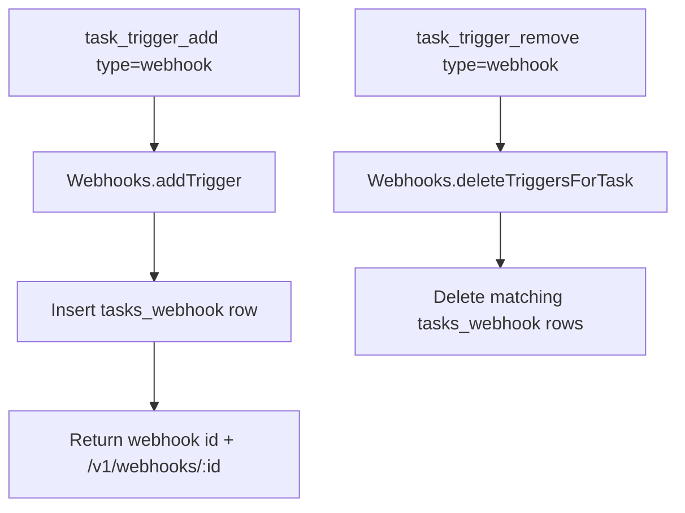

# Webhook Triggers

Webhook triggers add a third task trigger mode (with cron and heartbeat).
Each webhook trigger is a cuid2 id used as both identifier and secret.

## What Was Added

- `tasks_webhook` storage table and migration (`20260227_webhook_triggers.sql`)
- `WebhookTasksRepository` for CRUD + caching
- `Webhooks` facade for trigger creation, listing, deletion, and execution
- `task_trigger_add` / `task_trigger_remove` support for `type: "webhook"`
- `task_read` output now includes webhook trigger URLs
- `task_create` supports `webhook: true`
- `task_delete` removes webhook triggers
- IPC routes:
  - `POST /v1/webhooks/:id`
  - `GET /v1/engine/webhook/tasks`

## Data Model


## Trigger Execution Flow

```mermaid
flowchart LR
    A[External caller] --> B[POST /v1/webhooks/:id]
    B --> C[Webhooks.trigger(id, body)]
    C --> D[Lookup tasks_webhook by id]
    D --> E[Lookup task by taskId + userId]
    E --> F[agentSystem.postAndAwait]
    F --> G[Run task Python code]
```

## Tool Flow


