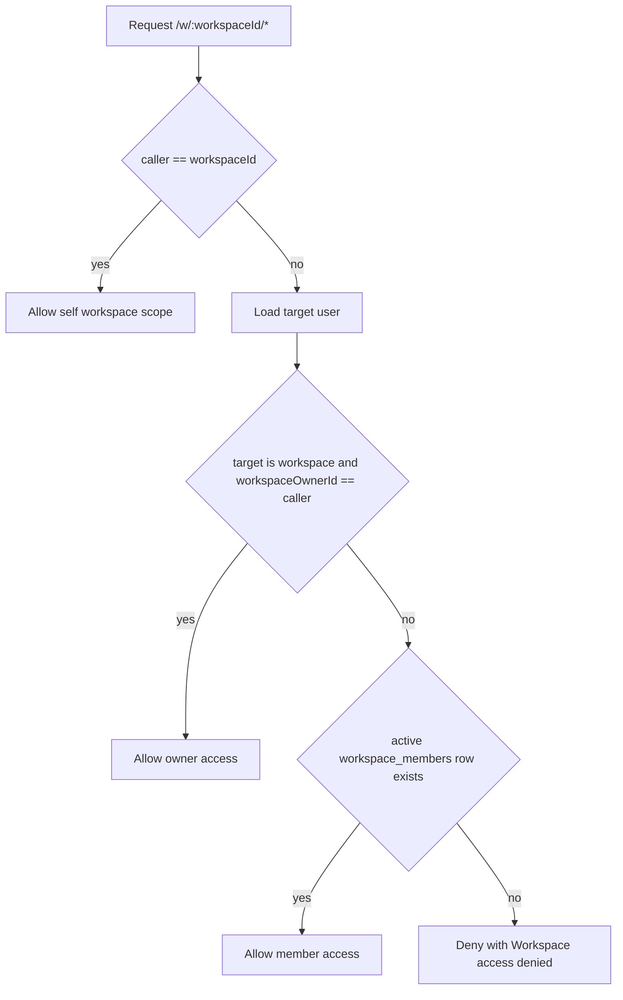
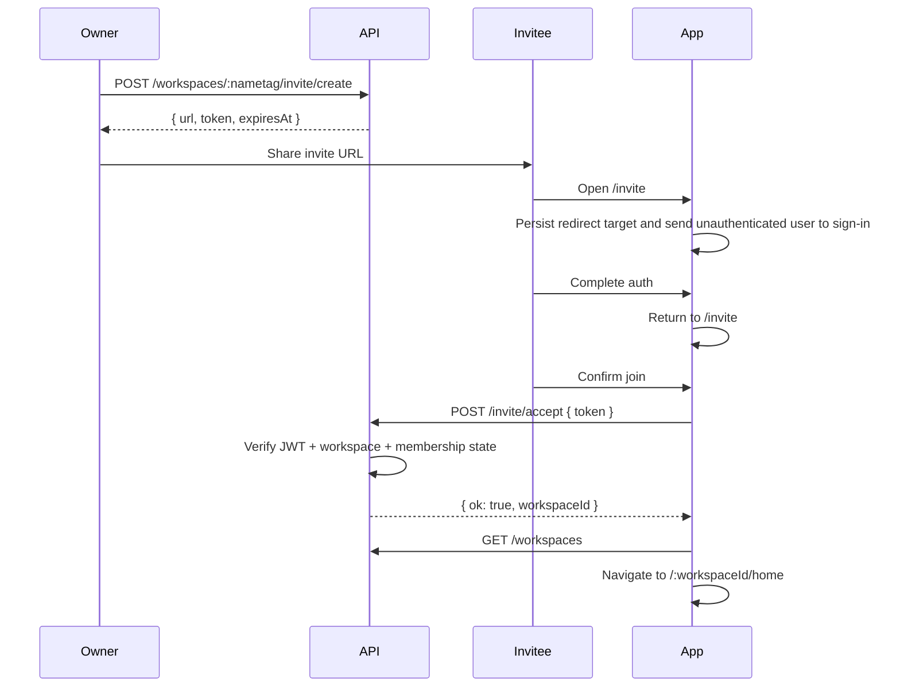

# Workspace Members and Invites

Daycare workspaces now support explicit membership rows and reusable invite links.

## What Changed

- Shared workspace access is no longer owner-only.
- Active members are stored in `workspace_members`.
- Invite links are short-lived JWT-backed app URLs that open the `/invite` screen.
- Joined workspaces are included in the app workspace switcher.
- Kicked members lose `GET /w/:workspaceId/...` access immediately and cannot rejoin with the same workspace invite flow.

## Access Resolution

## Invite Flow

