# ClayBot documentation

This folder documents the current ClayBot CLI, plugins, sessions, and runtime.

## Index
- `architecture.md` - system overview and message flow
- `cli.md` - CLI commands and runtime behavior
- `connectors.md` - connector abstraction and telegram connector
- `plugins.md` - plugin system and built-in plugins
- `dashboard.md` - claybot-dashboard SPA + proxy
- `memory.md` - memory plugin and entities
- `cron.md` - cron scheduler tasks and actions
- `auth.md` - auth store and helper commands
- `inference.md` - inference runtime helpers
- `util.md` - shared utility helpers
- `conventions.md` - import and compatibility rules
- `sessions.md` - session queueing and sequencing
- `session-types.md` - session descriptors and resolution
- `config.md` - config files and resolution order
- `logging.md` - logging configuration and output
- `engine.md` - engine socket updates and control plane
- `testing.md` - current test coverage
- `skills.md` - agent skills and loading workflow
- `agent-system.md` - agent system lifecycle and session ownership

```mermaid
flowchart TD
  Docs[Documentation] --> Arch[architecture.md]
  Docs --> CLI[cli.md]
  Docs --> Conn[connectors.md]
  Docs --> Plugins[plugins.md]
  Docs --> Dash[dashboard.md]
  Docs --> Memory[memory.md]
  Docs --> Sess[sessions.md]
  Docs --> SessTypes[session-types.md]
  Docs --> Config[config.md]
  Docs --> Auth[auth.md]
  Docs --> Log[logging.md]
  Docs --> Engine[engine.md]
  Docs --> Test[testing.md]
  Docs --> Util[util.md]
  Docs --> Conv[conventions.md]
  Docs --> Infer[inference.md]
  Docs --> Skills[skills.md]
  Docs --> AgentSystem[agent-system.md]
```

