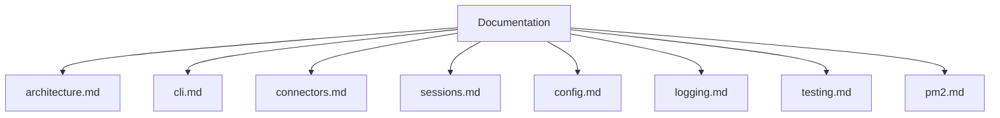

# Scout documentation

This folder documents the current Scout CLI, connectors, sessions, and logging.

## Index
- `architecture.md` - system overview and message flow
- `cli.md` - CLI commands and runtime behavior
- `connectors.md` - connector abstraction, telegram, and chron connector
- `cron.md` - cron scheduler tasks and actions
- `pm2.md` - pm2 runtime process management
- `sessions.md` - session queueing and sequencing
- `config.md` - config files and resolution order
- `logging.md` - logging configuration and output
- `testing.md` - current test coverage

