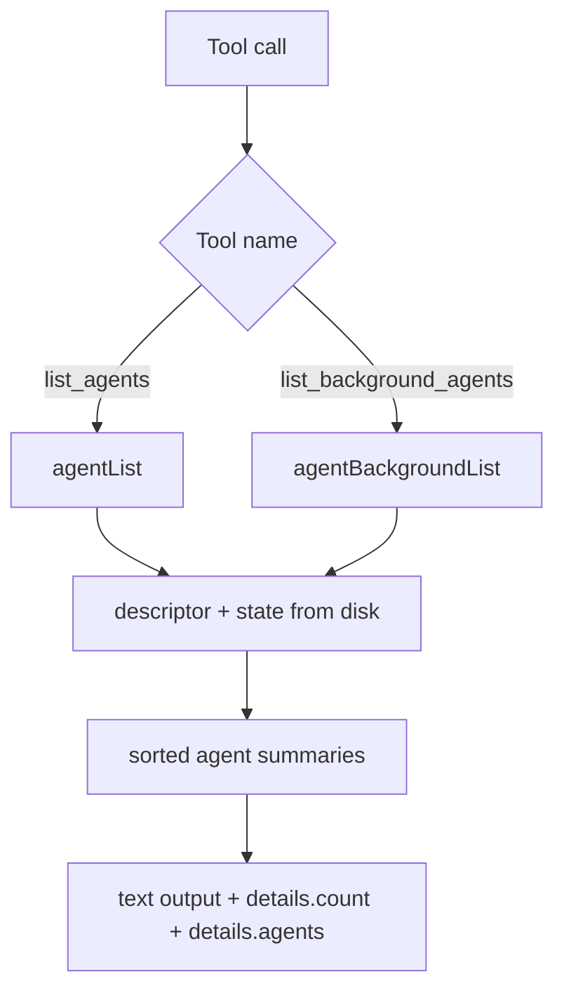

# Agent List Tools

Daycare now includes two listing tools for session/agent discovery:

- `list_agents`: all persisted agents (user + background) with ids, type, name/label, and lifecycle.
- `list_background_agents`: persisted non-user agents with ids, names, lifecycle, status, queue count, and parent linkage.

Both tools return machine-readable `details` payloads with a `count` and `agents` array.

