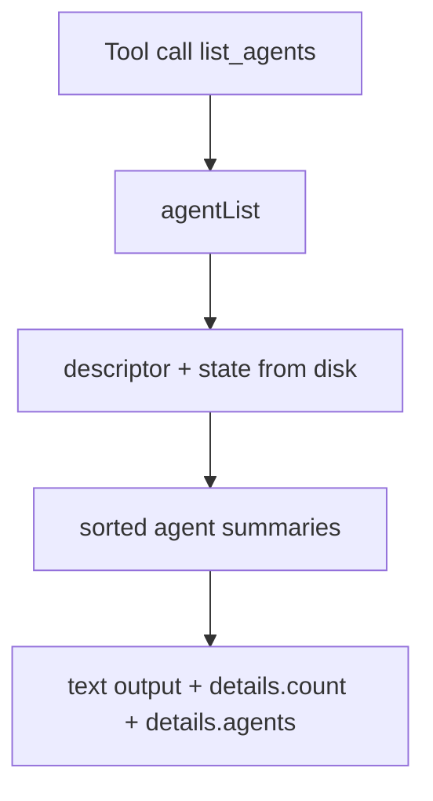

# Agent List Tools

Daycare includes one listing tool for session/agent discovery:

- `list_agents`: all persisted agents (user + background) with ids, type, name/label, lifecycle, and descriptor-specific metadata.

The tool returns a machine-readable `details` payload with `count` and `agents`.

