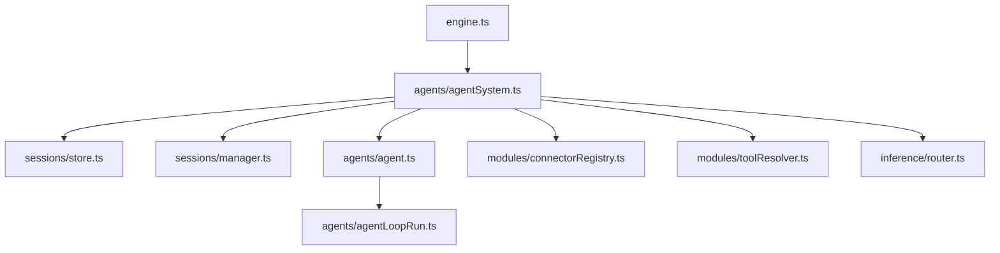

# AgentSystem

AgentSystem owns the session-backed agent lifecycle:
- load agent sessions from disk
- queue inbound messages before execution starts
- spawn and message background agents
- expose session info for resets and status

AgentSystem boots in stages:
1. **load()** restores sessions + queues pending notifications (no execution)
2. **enableScheduling()** lets the module registry enqueue messages
3. **start()** drains queues and begins agent execution

