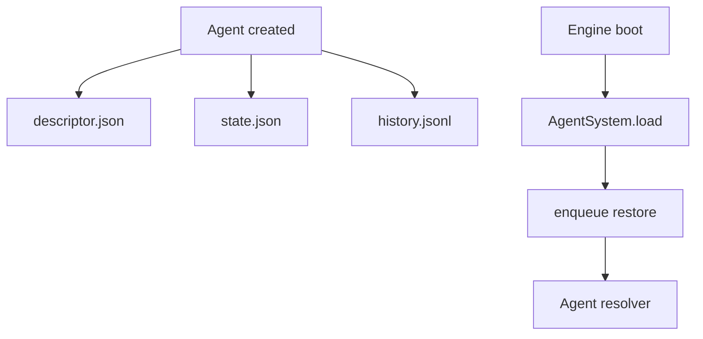
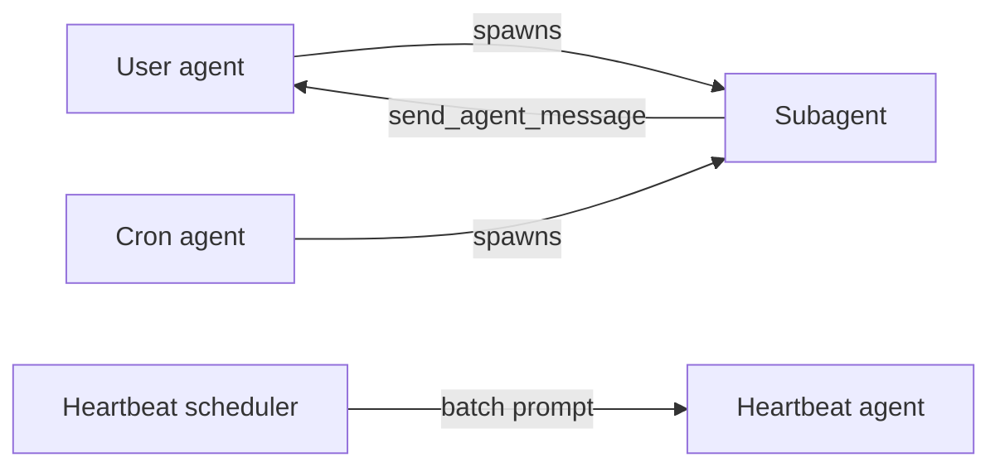
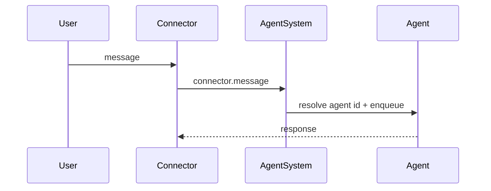
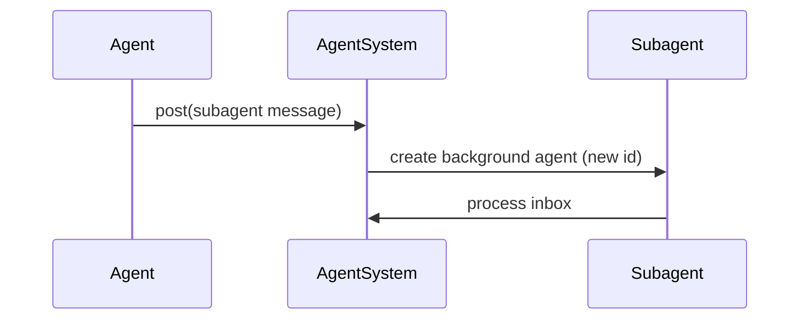
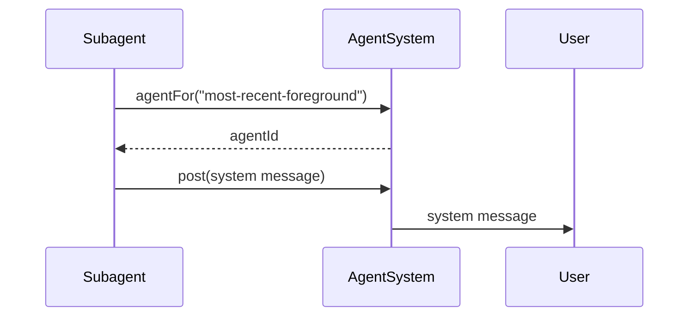
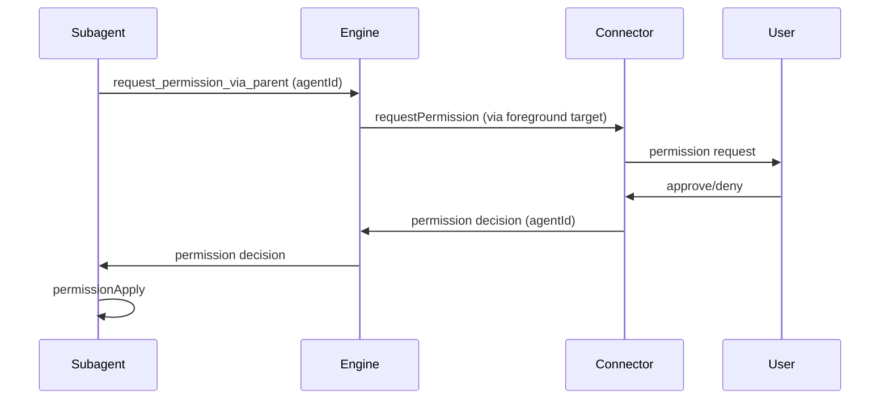

# Agent types

Agent types are persisted descriptors that capture what an agent represents
and how it should be resolved later. They are written once on creation and
restored on boot to keep agent identity stable across restarts.



## Descriptor shape

Agent descriptors live in `agents/<id>/descriptor.json`.

```ts
type AgentDescriptor =
  | { type: "user"; connector: string; userId: string; channelId: string }
  | { type: "cron"; id: string }
  | { type: "heartbeat" }
  | { type: "subagent"; id: string; parentAgentId: string; name: string };
```

Notes:
- `user` is a foreground connector conversation.
- `cron` maps to a scheduled task uid.
- `heartbeat` maps to the single heartbeat batch agent.
- `subagent` is any background agent and always includes a parent + name.

## Persistence rules

1. On agent creation, the engine writes `descriptor.json` and `state.json`.
2. `history.jsonl` stores minimal `start`/`reset` markers plus user/assistant/tool records.
3. On restart, AgentSystem loads descriptor + state and queues a restore message.
4. History is reconstructed starting after the most recent `start` or `reset` marker.

## Fetch strategies

Only two fetch strategies are supported:

```ts
type AgentFetchStrategy = "most-recent-foreground" | "heartbeat";
```

Resolution behavior:
- `most-recent-foreground` selects the most recent agent with a `user` descriptor.
- `heartbeat` selects the most recent agent with a `heartbeat` descriptor.

## How agent types operate together



Operational notes:
- User agents are the only agents treated as foreground.
- Subagents always have a parent (usually a user agent, cron, or heartbeat).
- Heartbeat runs always map to a single `heartbeat` agent that runs a batch prompt.
- Cron agents are scheduled inputs; they can spawn subagents but are not foreground targets.

## Message delivery

### User message to agent



Delivery notes:
- Agent id is resolved from the persisted `user` descriptor (connector + user + channel).
- The agent inbox preserves ordering; updates are persisted on each step.

### Agent to subagent



Delivery notes:
- Subagents always carry `parentAgentId` and `name`.
- Each subagent starts with a new cuid2 id; existing ids are not reused.
- The subagent descriptor is persisted on creation.

### Subagent back to user



Delivery notes:
- The `most-recent-foreground` strategy selects the most recent `user` agent.
- Subagents default to their `parentAgentId`; other agents fall back to
  `most-recent-foreground` when no agent id is provided.

### Permission request via foreground agent

Background agents cannot request permissions directly. They use
`request_permission_via_parent` to proxy requests through the most recent
foreground agent.



Delivery notes:
- Permission requests include the requesting agent id.
- When a decision arrives, the engine routes it directly to that agent.

## Restore behavior

On startup the engine loads agents from disk and enqueues a restore message.
Restore reconstructs inference context from history after the latest reset/start
marker; it does not retry pending inbound messages.

## Implementation references

- Descriptor type + normalization: `packages/claybot/sources/engine/agents/agentDescriptorTypes.ts`
- Persistence ops: `packages/claybot/sources/engine/agents/ops/`
- Resolver + usage: `packages/claybot/sources/engine/agents/agentSystem.ts`
