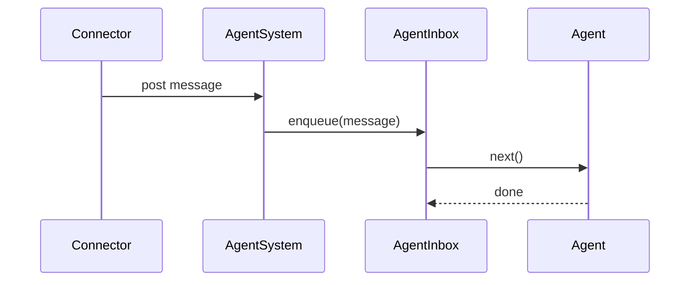
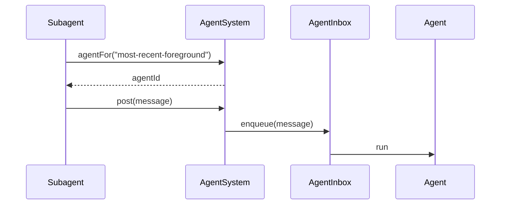
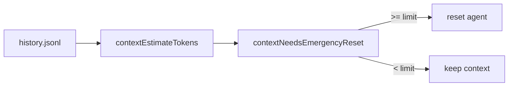
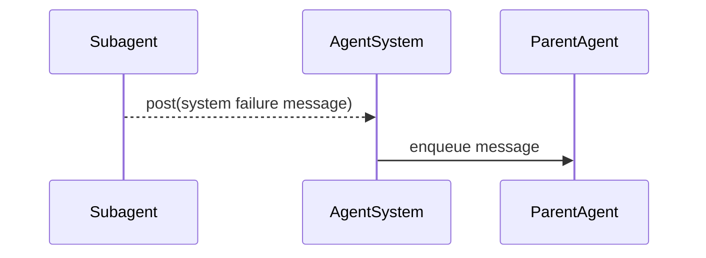
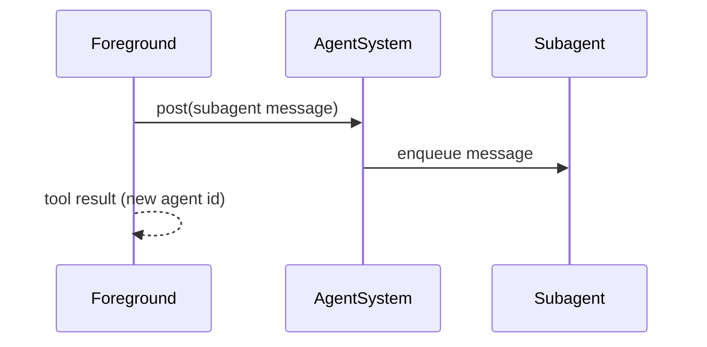
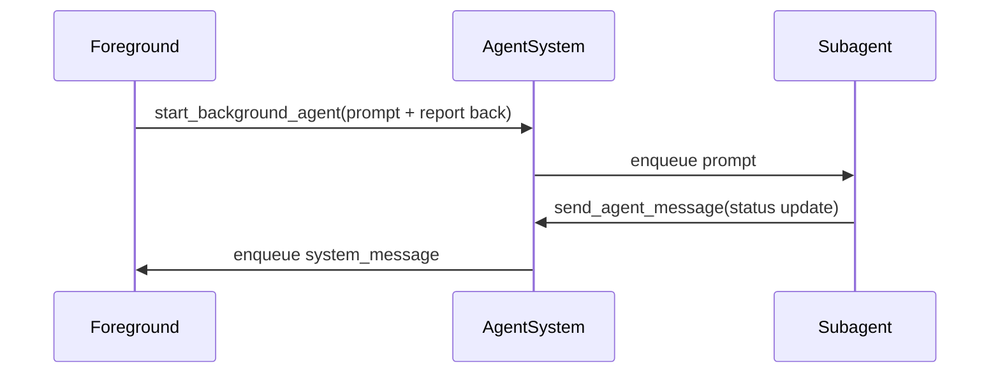

# Agents

Agents provide per-channel sequencing of messages, ensuring each agent is handled one message at a time.

## Agent identity rules
- Agent ids are cuid2 values mapped to user descriptors (`connector + channelId + userId`), cron task uid, or heartbeat.
- Connectors provide user descriptors for mapping; `MessageContext` only carries message-level metadata.
- Messages (and files) are queued and processed in order via `AgentInbox`.

## Message source resolution
Inbox items store message content and context only; the connector source is resolved from the
agent descriptor when handling a message.

## System message delivery
When `send_agent_message` omits a target agent id, the tool asks for the most recent
foreground agent and posts a system message using the target agent’s connector.

## System message format
`send_agent_message` wraps the payload in a `<system_message>` tag with an origin attribute so
agents can distinguish internal updates from user input.

## Agent persistence
- Agents are written to `.claybot/agents/<cuid2>/` as discrete files.
- `descriptor.json` captures the agent type and identity.
- `state.json` stores provider selection, permissions, and timestamps.
- `history.jsonl` stores minimal user/assistant/tool records.
- History is restored starting after the most recent `start` or `reset` marker.

## Model context reconstruction
History records are expanded into inference context on restore.

## Emergency context pruning
The agent estimates context size from history and compares it to the emergency limit
(`settings.agents.emergencyContextLimit`, default 200000).

## Subagent failure notifications
Background agents post a single failure notification to the parent agent.

## Background agent start
Starting a subagent posts the first message and returns immediately; each call creates a new background agent.

## Background agent reporting
Foreground prompts should instruct subagents to report progress via `send_agent_message`.

## Resetting agents
- Agents can be reset without changing the agent id.
- Reset clears the stored context messages and appends a `reset` marker in history.
- Connectors are responsible for handling reset commands; the engine does not interpret slash commands.

## Key types
- `AgentMessage` stores message, context, and timestamps.
- `AgentState` holds mutable per-agent state.
- `FileReference` links attachments in the file store.
