# Agents

Agents provide per-channel sequencing of messages, ensuring each agent is handled one message at a time.

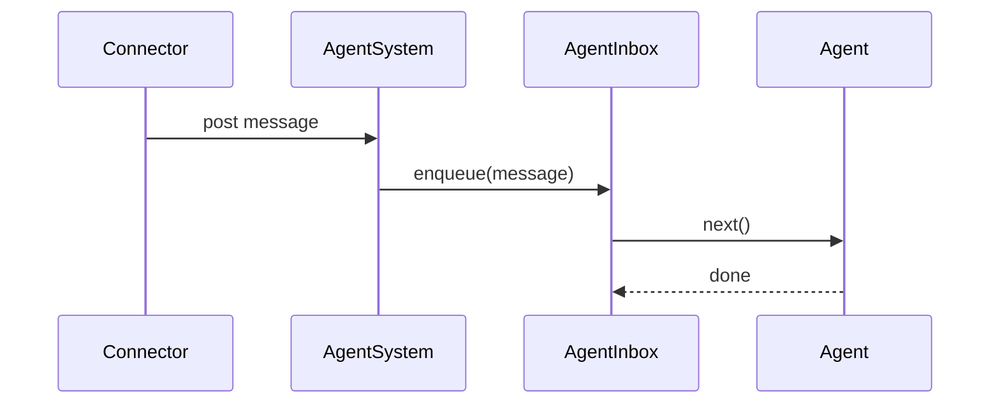

## Agent identity rules
- Agent ids are cuid2 values mapped to user descriptors (`connector + channelId + userId`), cron task uid, or heartbeat.
- Connectors provide user descriptors for mapping; `MessageContext` only carries message-level metadata.
- Messages (and files) are queued and processed in order via `AgentInbox`.

## Message source resolution
Inbox items store message content and context only; the connector source is resolved from the
agent descriptor when handling a message.

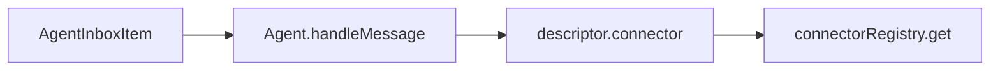

## System message delivery
`send_agent_message` posts a `system_message` inbox item. The agent wraps the text
as a `<system_message>` tag before running the inference loop. When a target agent id
is omitted, the tool resolves the most recent foreground agent.

```mermaid
flowchart LR
  SendTool[send_agent_message] --> Post[agentSystem.post(system_message)]
  Post --> Agent[Agent.handleSystemMessage]
  Agent --> Wrap[messageBuildSystemText]
```

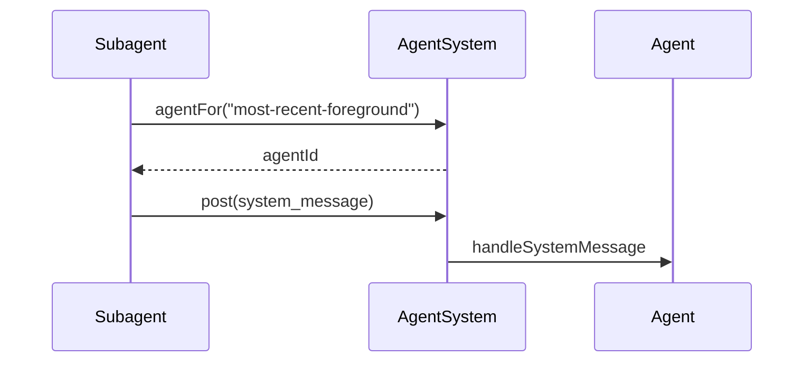

## System message format
Agents wrap system message text in a `<system_message>` tag with an origin attribute set to the
sender’s agent id so they can distinguish internal updates from user input.

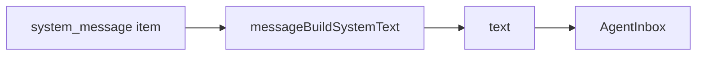

## System message persistence
System messages are treated like normal incoming messages. They are recorded in
`history.jsonl` and included in the rebuilt runtime context so agents can see
them and logs show the full flow.

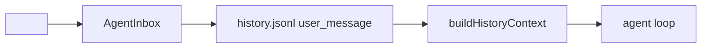

## Silent system messages
Silent system messages are recorded in history and added to the runtime context,
but they do not trigger an inference step.

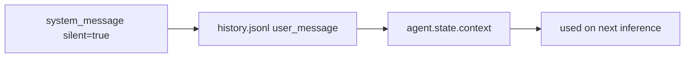

## Image token estimation
Image payloads are treated as non-text during token estimation. Inline image data is
sanitized to a `"<image>"` placeholder so token counts do not scale with base64 size.

```mermaid
flowchart LR
  Image[image content/data] --> Sanitize[replace data with "<image>"]
  Sanitize --> Estimate[estimate symbols/tokens]
```

## Permission request forwarding
Background agents use `request_permission`. The engine shows the request to the user and also
notifies the most recent foreground agent via silent system messages (request presented + decision).

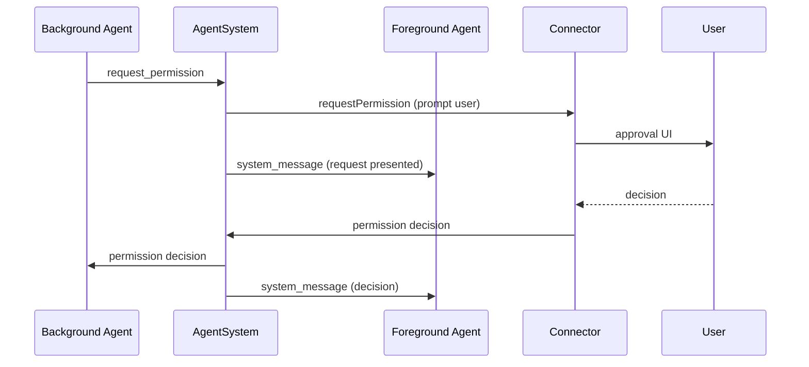

## Tool loop exhaustion warnings
Tool execution limit notices are only emitted when the last response actually contained tool calls.

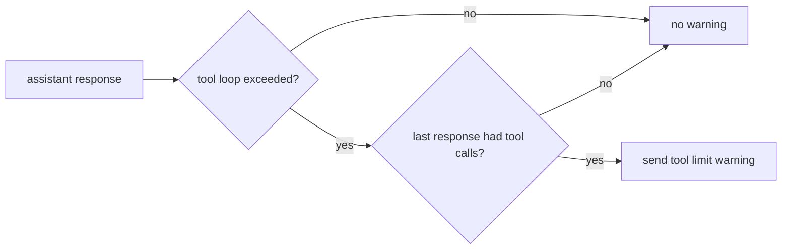

## Agent persistence
- Agents are written to `.daycare/agents/<cuid2>/` as discrete files.
- `descriptor.json` captures the agent type and identity.
- `state.json` stores provider selection, permissions, and timestamps.
- `history.jsonl` stores minimal user/assistant/tool records.
- History is restored starting after the most recent `start` or `reset` marker.

## Model context reconstruction
History records are expanded into inference context on restore.


## Emergency context pruning
The agent estimates context size from history and compares it to the emergency limit
(`settings.agents.emergencyContextLimit`, default 200000).

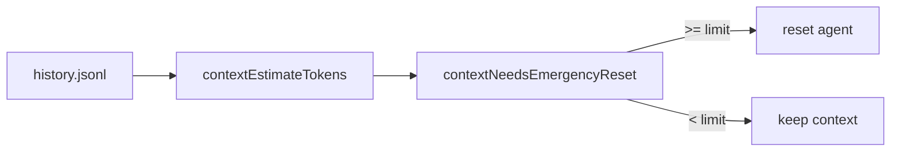

## Subagent failure notifications
Background agents post a single failure notification to the parent agent.

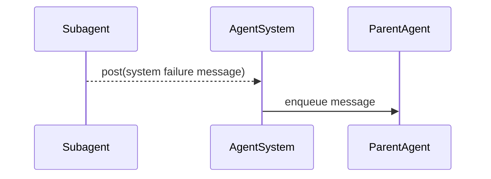

## Background agent start
Starting a subagent posts the first message and returns immediately; each call creates a new background agent.

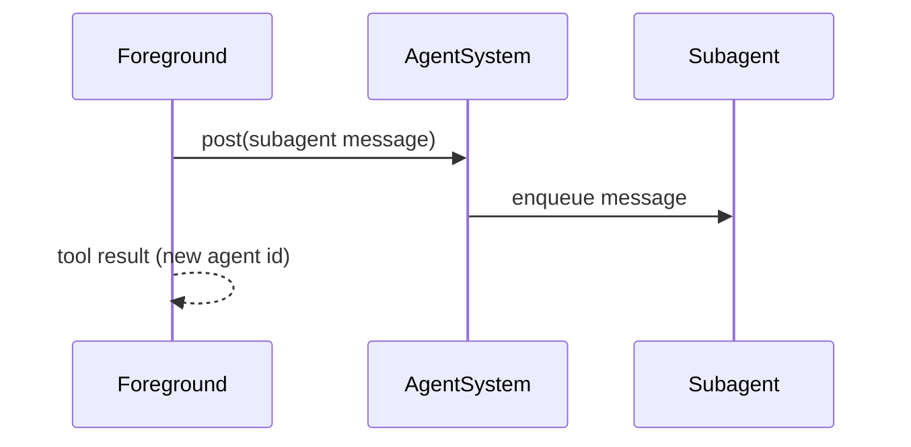

## Background agent reporting
Foreground prompts should instruct subagents to report progress via `send_agent_message`.

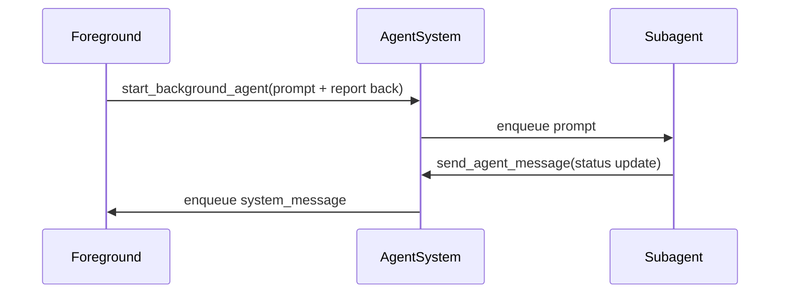

## Resetting agents
- Agents can be reset without changing the agent id.
- Reset clears the stored context messages and appends a `reset` marker in history.
- Connectors are responsible for handling reset commands; the engine does not interpret slash commands.

## Key types
- `AgentMessage` stores message, context, and timestamps.
- `AgentState` holds mutable per-agent state.
- `FileReference` links attachments in the file store.
