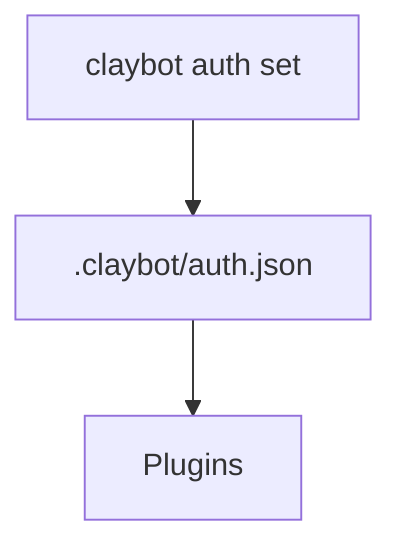

# Auth Store

Claybot stores credentials in `.claybot/auth.json`.
The file is read by the engine on startup and on demand by plugins.

## Structure
```json
{
  "telegram": { "type": "token", "token": "..." },
  "brave-search": { "type": "apiKey", "apiKey": "..." },
  "openai": { "type": "apiKey", "apiKey": "..." },
  "anthropic": { "type": "oauth", "refreshToken": "...", "accessToken": "..." },
  "nanobanana": { "type": "apiKey", "apiKey": "..." }
}
```

Auth entries are keyed by the identifier used by the plugin or provider. Providers always use
the provider id.

## CLI helpers
- `claybot auth set <id> <key> <value>` updates the auth store.



## Usage
- Connectors read auth for tokens (e.g., Telegram).
- Providers read auth for API keys or OAuth credentials.
- Tool plugins read auth for external services.
