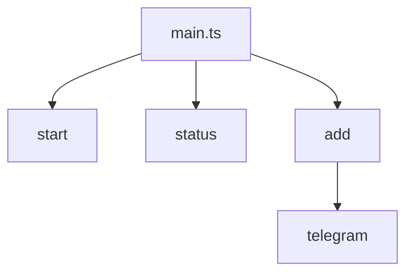
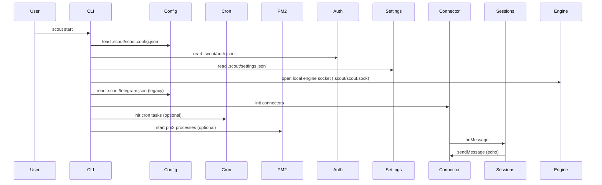

# CLI

The CLI is implemented with Commander in `sources/main.ts`. It always initializes logging first.

## Commands
- `start` - launches configured connectors and attaches the echo handler (default config `.scout/scout.config.json`).
- `status` - placeholder status command.
- `add telegram` - prompts for a bot token and updates the engine (local socket if running, otherwise `.scout/auth.json`).
- `add codex` - prompts for a Codex token + model id and updates auth + settings.
- `add claude` - prompts for a Claude Code token + model id and updates auth + settings.
- `remove telegram` - removes Telegram connector auth and unloads it if the engine is running.

### `add` options
- `--model <id>` sets the model id without prompting.
- `--main` marks the agent as primary (moves it to the front of the priority list).

## Development
- `yarn dev` runs the CLI directly via `tsx`.

## start command flow

