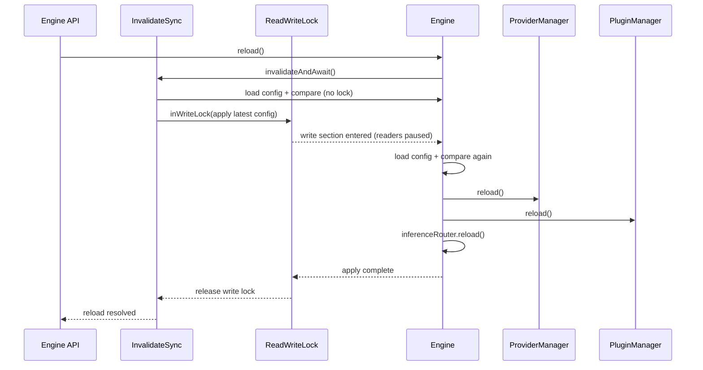
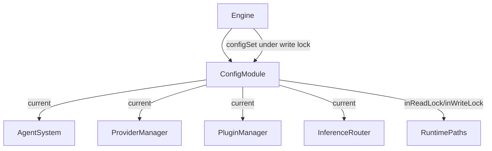

# Config reload locking

Engine config reload now applies online through `Engine.reload()` using `InvalidateSync`.
Reload requests coalesce; each sync run first checks for config changes outside the lock, then
re-reads and re-checks inside the runtime write lock before applying.
Runtime config state and lock now live in `ConfigModule` (`current config` + `configurationLock`),
and that module is shared across engine modules.
Modules now receive that shared module as `config` and call `config.inReadLock(...)` directly
instead of callback-style lock plumbing.
`AgentSystem` no longer exposes a `reload` method; config mutation is centralized in
`Engine.reloadApplyLatest()` via `ConfigModule.configSet(...)` under write lock.
Subsystem reload paths (`ProviderManager`, `PluginManager`) now refresh from `config.current`
without receiving config payloads or calling `configSet(...)`.
`InferenceRouter` also owns a shared `ConfigModule` reference and exposes `reload()`
to rebuild active provider preferences from `config.current.settings`.

Read-locked runtime paths now include:
- connector message/command/permission handlers
- agent inbox item processing
- inference router completions
- cron scheduler task execution (tick scheduling is unlocked)
- heartbeat scheduler runs

This currently favors strict quiescence over reload latency: a config write lock
waits for in-flight inference calls to finish before applying changes.

Plugin/provider reload behavior during apply:
- providers: deep-equal settings are no-op; changed settings unload/load; unload always removes registry entries bound to the provider id
- plugins: deep-equal settings are no-op; changed settings unload/load; unload calls plugin `unload` first, then unregisters all registrar-owned modules
- plugin manager `load()` now unloads an already-loaded instance id before loading again, preventing stale tool/module registrations across restart-style reloads

Operational notes:
- connector callbacks catch and log failures so connector event loops do not produce unhandled promise rejections
- agent sleep persistence runs after inbox item read-lock work completes, so config reload is not blocked by sleep-state disk writes
- plugin inference clients now read settings via shared `ConfigModule` directly (no manager callback indirection)

