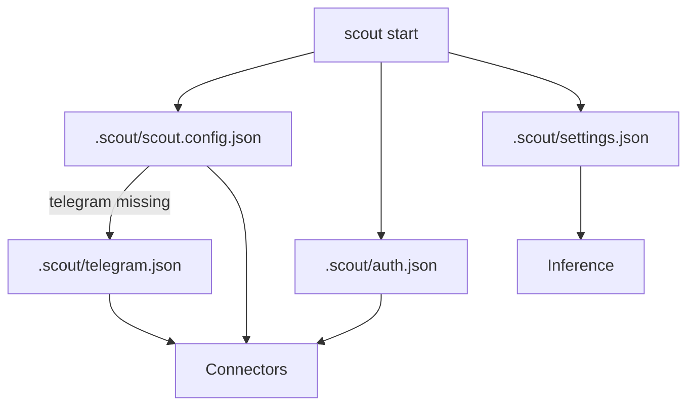

# Configuration

Scout reads config in two places when starting:
1. `.scout/scout.config.json` (or the path passed to `scout start --config`).
2. `.scout/auth.json` for connector/inference tokens.
3. `.scout/settings.json` for agent configuration (provider + model).
4. `.scout/telegram.json` as a legacy fallback for Telegram tokens.



## Sample `.scout/scout.config.json`
```json
{
  "connectors": {
    "telegram": {
      "token": "...",
      "polling": true,
      "statePath": ".scout/telegram-offset.json",
      "retry": {
        "minDelayMs": 1000,
        "maxDelayMs": 30000,
        "factor": 2,
        "jitter": 0.2
      }
    }
  },
  "cron": {
    "tasks": [
      {
        "id": "heartbeat",
        "everyMs": 60000,
        "message": "ping",
        "action": "send-message",
        "runOnStart": true,
        "channelId": "local",
        "source": "telegram"
      }
    ]
  },
  "runtime": {
    "pm2": {
      "processes": [
        {
          "name": "worker",
          "script": "dist/worker.js",
          "args": ["--mode", "job"],
          "autorestart": true
        }
      ]
    },
    "containers": {
      "connection": {
        "socketPath": "/var/run/docker.sock"
      },
      "containers": [
        {
          "name": "redis",
          "action": "ensure-running"
        }
      ]
    }
  }
}
```

Notes:
- `cron` is the top-level config for scheduled tasks.
- `runtime.pm2` configures PM2-managed processes.
- `runtime.containers` manages Docker containers via the Engine API.
- Agent priority is stored in `.scout/settings.json`.

## `.scout/auth.json`
Written by `scout add telegram`, `scout add codex`, and `scout add claude`.

```json
{
  "telegram": { "token": "..." },
  "codex": { "token": "..." },
  "claude-code": { "token": "..." }
}
```

## `.scout/settings.json`
Written by `scout add codex` and `scout add claude`.

```json
{
  "agents": [
    { "provider": "codex", "model": "gpt-5.1-codex-mini", "main": true },
    { "provider": "claude-code", "model": "claude-3-7-sonnet-latest" }
  ]
}
```

Agent priority comes from the array order (last entry is lowest priority).
Setting `main: true` moves the agent to the front and clears `main` on others.
If a model id is missing or invalid, Scout uses the pi-ai model registry to pick a default.

## `.scout/telegram.json` (legacy)
Still read if no telegram token is found in `.scout/auth.json`.
```json
{ "token": "..." }
```
