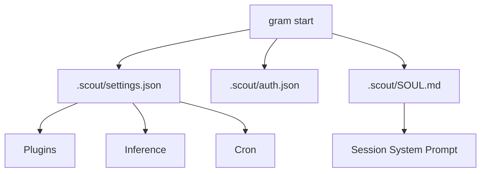

# Configuration

Grambot now reads from a single settings file plus the auth store.

- `.scout/settings.json` (or the path passed to `gram start --settings`)
- `.scout/auth.json` for credentials
- `.scout/SOUL.md` for the system prompt (optional)



## Sample `.scout/settings.json`
```json
{
  "engine": {
    "socketPath": ".scout/scout.sock",
    "dataDir": ".scout"
  },
  "plugins": [
    { "instanceId": "telegram", "pluginId": "telegram", "enabled": true, "settings": { "polling": true } },
    { "instanceId": "brave-search", "pluginId": "brave-search", "enabled": true },
    { "instanceId": "memory", "pluginId": "memory", "enabled": true }
  ],
  "providers": [
    { "id": "openai", "enabled": true, "model": "gpt-4o-mini" },
    { "id": "nanobanana", "enabled": false, "image": { "endpoint": "https://api.example.com/images" } }
  ],
  "cron": {
    "tasks": [
      {
        "id": "heartbeat",
        "everyMs": 60000,
        "message": "ping",
        "action": "send-message",
        "runOnStart": true,
        "channelId": "local",
        "source": "telegram"
      }
    ]
  },
  "memory": {
    "enabled": true,
    "maxEntries": 1000
  }
}
```

`memory` settings are consumed by the memory plugin (if enabled). Providers are configured
at the top level; order defines inference priority and `enabled: false` disables a provider.

## `.scout/auth.json`
Credentials are stored per plugin or provider id:

```json
{
  "telegram": { "type": "token", "token": "..." },
  "brave-search": { "type": "apiKey", "apiKey": "..." },
  "openai": { "type": "apiKey", "apiKey": "..." },
  "anthropic": { "type": "apiKey", "apiKey": "..." },
  "nanobanana": { "type": "apiKey", "apiKey": "..." }
}
```

## `.scout/SOUL.md`
The system prompt defines the assistant's personality and behavior. Create this file
to customize how the assistant responds:

```bash
gram init
```

This creates a default SOUL.md that you can edit:

```markdown
# System Prompt

You are a helpful assistant. Be concise and direct in your responses.

## Guidelines

- Respond in the same language as the user
- Ask clarifying questions when needed
- Be honest about limitations
```

The system prompt is loaded when the engine starts and applied to all new sessions.
Edit SOUL.md and restart the engine to apply changes.
