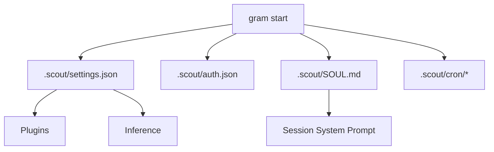

# Configuration

Grambot now reads from a single settings file plus the auth store.

- `.scout/settings.json` (or the path passed to `gram start --settings`)
- `.scout/auth.json` for credentials
- `.scout/SOUL.md` for the system prompt (optional)



## Sample `.scout/settings.json`
```json
{
  "engine": {
    "socketPath": ".scout/scout.sock",
    "dataDir": ".scout"
  },
  "plugins": [
    { "instanceId": "telegram", "pluginId": "telegram", "enabled": true, "settings": { "polling": true } },
    { "instanceId": "brave-search", "pluginId": "brave-search", "enabled": true },
    { "instanceId": "memory", "pluginId": "memory", "enabled": true }
  ],
  "providers": [
    { "id": "openai", "enabled": true, "model": "gpt-4o-mini" },
    { "id": "nanobanana", "enabled": false, "image": { "endpoint": "https://api.example.com/images" } }
  ]
}
```

Memory settings are configured per plugin instance. Providers are configured
at the top level; order defines inference priority and `enabled: false` disables a provider.

## Cron tasks
Cron tasks are stored as markdown files in `<config>/cron/<task-id>/TASK.md` with frontmatter:

```markdown
---
name: Weekly Summary
schedule: "0 9 * * 1"
enabled: true
---

Summarize the weekly updates.
```

Each task directory also contains `MEMORY.md` and a `files/` workspace.

Supported frontmatter fields include `description` and `deleteAfterRun` for one-off tasks.

## `.scout/auth.json`
Credentials are stored per plugin or provider id:

```json
{
  "telegram": { "type": "token", "token": "..." },
  "brave-search": { "type": "apiKey", "apiKey": "..." },
  "openai": { "type": "apiKey", "apiKey": "..." },
  "anthropic": { "type": "apiKey", "apiKey": "..." },
  "nanobanana": { "type": "apiKey", "apiKey": "..." }
}
```

## `.scout/SOUL.md`
The soul file defines the assistant's personality. A default is created on first run:

```markdown
# System Prompt

You are a helpful assistant. Be concise and direct in your responses.

## Guidelines

- Respond in the same language as the user
- Ask clarifying questions when needed
- Be honest about limitations
```

Edit SOUL.md to customize the assistant. Changes take effect on the next message.

The soul is embedded into a system prompt template (`SYSTEM.md`) that includes
runtime context:

```markdown
You are an AI assistant.

Current date: {{date}}

## Runtime

- OS: {{os}}
- Architecture: {{arch}}
- Model: {{model}}
- Provider: {{provider}}
- Workspace: {{workspace}}

## Personality

{{{soul}}}
```

The template uses Handlebars syntax. `{{{soul}}}` (triple braces) preserves markdown formatting.
