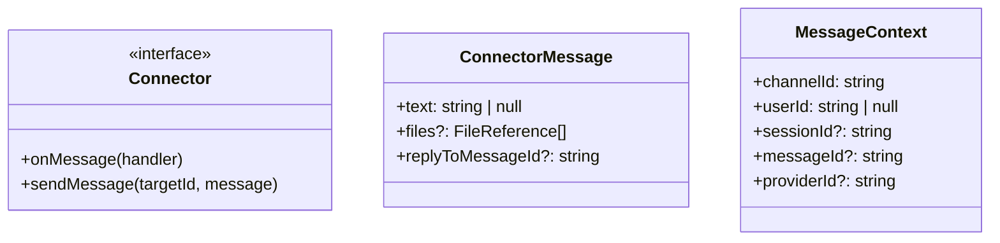
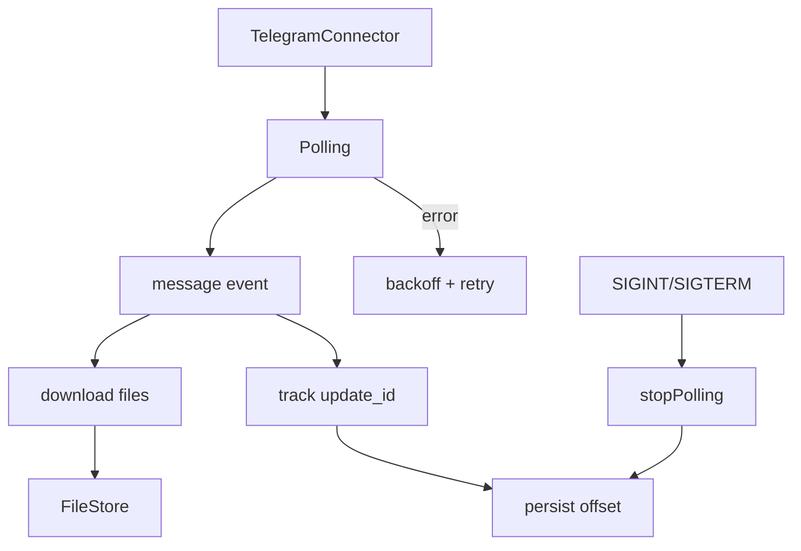

# Connectors

Connectors are plugin modules that bridge Claybot to external systems.
They emit messages (text + files) into sessions and send responses back.

## Connector interface
Each connector exposes:
- `onMessage(handler)` to receive `ConnectorMessage` events.
- `sendMessage(targetId, message)` to respond (including files).

Messages are normalized to:
```
{ text: string | null, files?: FileReference[], replyToMessageId?: string }
```



## Telegram connector
- Implemented as the `telegram` plugin.
- Uses long polling by default.
- Persists `lastUpdateId` to `.claybot/telegram-offset.json`.
- Downloads incoming files into the shared file store.
- Sends images/documents when tool results include files.
- Supports chat actions (typing) and reactions.


