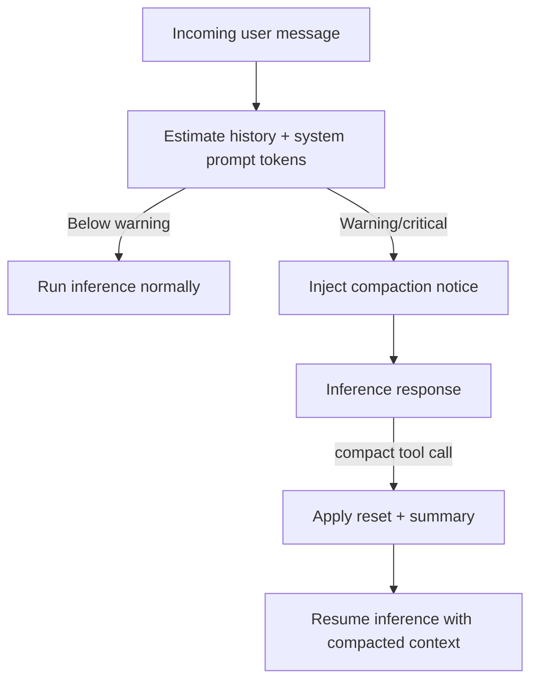

# Context compaction

ClayBot uses a warning-stage compaction flow to avoid hard context overflows. The agent estimates
context usage from recent history plus the current system prompt and injects a compaction notice when
thresholds are crossed.

## Strategy

- Warning threshold: 75% of `settings.agents.emergencyContextLimit`.
- Critical threshold: 90% of `settings.agents.emergencyContextLimit`.
- Estimates include the system prompt tokens (length / 4 heuristic).
- When warning/critical, a `<system_message>` notice is injected with the compaction prompt and
  instructions to call the `compact` tool.

## `compact` tool

Arguments:
- `summary`: Compaction prompt output (short, structured summary).
- `persist`: List of durable items to keep (paths, ids, TODOs, constraints, commands, URLs).

When the tool runs, the agent records a reset marker with the summary and rebuilds the active
context as:
1) the compaction summary system message
2) the latest user message (so the next inference can resume)

## Flow

