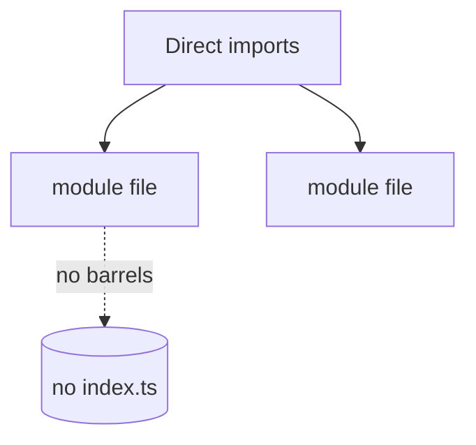

# Conventions

Grambot keeps module boundaries explicit, avoids barrel `index.ts` files, and skips internal compatibility shims.

- Import modules directly (e.g., `./log.js`, `./connectors/telegram.js`).
- Avoid internal compatibility shims between modules.

