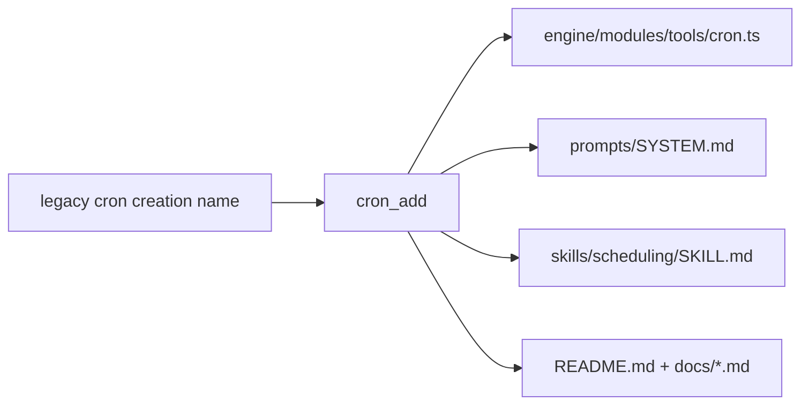

# Cron Tool Rename

This change standardizes the cron task creation tool name as `cron_add` across runtime registration, prompts, skills, and documentation.

## Scope

- Tool name exposed by the cron tool module is now `cron_add`.
- Prompt and skill docs now instruct usage of `cron_add`.
- User-facing docs and examples now reference `cron_add`.
