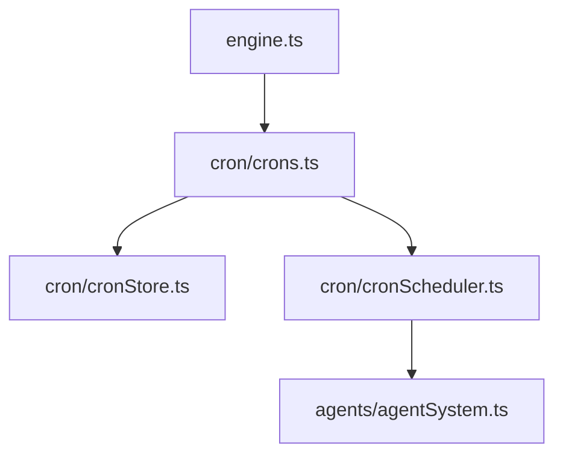

# Cron scheduler

Cron tasks are stored as markdown files on disk and are loaded at startup. Each task
has its own session, memory file, and workspace.

## Task storage

Tasks live under `<config>/cron/<task-id>/`:
- `TASK.md` - frontmatter + prompt body
- `MEMORY.md` - task memory (initialized to `No memory`)
- `files/` - workspace directory for cron task file operations

Example `TASK.md`:
```markdown
---
taskId: clx9rk1p20000x5p3j7q1x8z1
name: Daily Report
schedule: "0 9 * * *"
enabled: true
---

Generate the daily status report and summarize any blockers.
```

Frontmatter fields:
- `taskId` (required) - cuid2 identifier stored in frontmatter; tasks without a valid `taskId` are ignored
- `name` (required) - human-readable task name
- `schedule` (required) - 5-field cron expression (`minute hour day month weekday`)
- `enabled` (optional) - set to `false` to disable a task
- `description` (optional) - short description used by `cron_read_task`
- `deleteAfterRun` (optional) - when `true`, delete the task after it runs once

Task directory ids should be human-friendly slugs (e.g. `create-image-in-morning`).

## Execution model

- `Crons` owns storage + scheduling (`CronStore` + `CronScheduler`).
- `CronScheduler` reads tasks from disk and schedules the next run.
- Each task runs in its own session id (the `taskId` cuid2 from frontmatter).
- When a schedule triggers, the task prompt is sent as a message to that session.
- The system prompt includes the cron task metadata and the memory file location.



## Tools

- `add_cron` creates a new task on disk under `<config>/cron/`.
- `cron_read_task` reads a task's description and prompt.
- `cron_read_memory` reads a task's `MEMORY.md`.
- `cron_write_memory` overwrites (or appends to) a task's `MEMORY.md`.
- `cron_delete_task` deletes a task from disk and scheduler.
