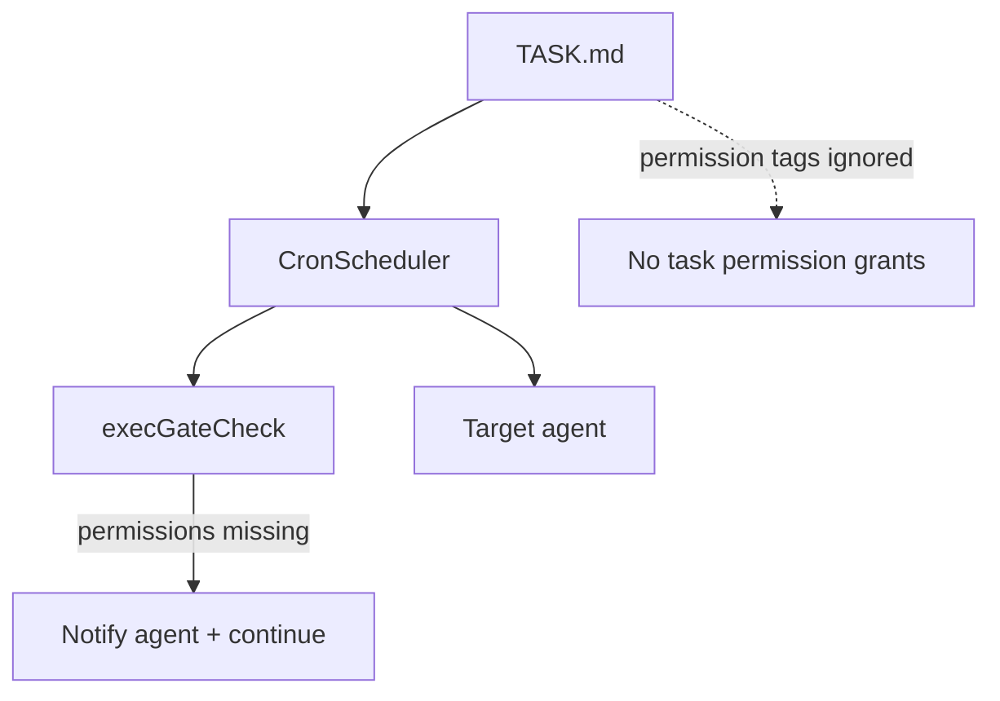

# Cron scheduler

Cron tasks are stored as markdown files on disk and are loaded at startup. Each task
has its own agent, memory file, and workspace.

## Task storage

Tasks live under `<config>/cron/<task-id>/`:
- `TASK.md` - frontmatter + prompt body
- `MEMORY.md` - task memory (initialized to `No memory`)
- `files/` - workspace directory for cron task file operations

Example `TASK.md`:
```markdown
---
taskId: clx9rk1p20000x5p3j7q1x8z1
name: Daily Report
schedule: "0 9 * * *"
enabled: true
agentId: cu3ql2p5q0000x5p3g7q1l8a9
gate:
  command: "curl -fsS https://api.example.com/healthz >/dev/null"
  packageManagers:
    - node
  allowedDomains:
    - api.example.com
---

Generate the daily status report and summarize any blockers.
```

Frontmatter fields:
- `taskId` (required) - cuid2 identifier stored in frontmatter; tasks without a valid `taskId` are ignored
- `name` (required) - human-readable task name
- `schedule` (required) - 5-field cron expression (`minute hour day month weekday`)
- `enabled` (optional) - set to `false` to disable a task
- `description` (optional) - short description used by `cron_read_task`
- `deleteAfterRun` (optional) - when `true`, delete the task after it runs once
- `agentId` (optional) - route the cron prompt to an existing agent id (defaults to the cron agent)
- `gate` (optional) - exec gate config (command + permissions + allowlist) that must succeed to run

Task directory ids should be human-friendly slugs (e.g. `create-image-in-morning`).

## Execution model

- `Crons` owns storage + scheduling (`CronStore` + `CronScheduler`).
- `CronScheduler` reads tasks from disk and schedules the next run.
- Each task runs in its own agent id (the `taskId` cuid2 from frontmatter) unless `agentId` routes elsewhere.
- If a `gate` is provided, the exec command must exit `0` for the task to run.
- When a schedule triggers, the task prompt is sent as a message to that agent.
- The system prompt includes the cron task metadata and the memory file location.

```mermaid
flowchart TD
  Engine[engine.ts] --> Crons[cron/crons.ts]
  Crons --> Store[cron/ops/cronStore.ts]
  Crons --> Scheduler[cron/ops/cronScheduler.ts]
  Scheduler --> Gate[execGateCheck]
  Gate -->|allow| AgentSystem[agents/agentSystem.ts]
  Gate -->|deny (exit != 0)| Skip[Skip run]
  Gate -->|permissions missing| Notify[Notify agent + continue]
```

## Exec Gate

`gate` runs a shell command before the LLM to decide if the cron should run.
Exit code `0` means "run"; non-zero means "skip." Trimmed gate output is appended
to the prompt under `[Gate output]`. Gates run with the target agent permissions.
`gate.permissions` may declare required permission tags. If they are not already
allowed by the target agent, a system message is posted and the gate is treated
as allowed (the task still runs). Network access requires `@network` plus
`gate.allowedDomains` to allowlist hosts. You can also use
`gate.packageManagers` (`dart`, `dotnet`, `go`, `java`, `node`, `php`, `python`, `ruby`, `rust`) to auto-allow language ecosystem hosts.
Set `gate.home` (absolute path in writable dirs) to remap HOME-related environment
variables for the gate command.

## Permissions

Cron tasks do not carry permission tags. Task prompts run with the
target agent's existing permissions only. Any `permissions` entries in
task files are ignored. `gate.permissions` are validated against the
target agent's permissions. If they are not already allowed, a system message
is posted and the task runs anyway (the gate is treated as successful).



## Tools

- `cron_add` creates a new task on disk under `<config>/cron/`.
- `cron_read_task` reads a task's description and prompt.
- `cron_read_memory` reads a task's `MEMORY.md`.
- `cron_write_memory` overwrites (or appends to) a task's `MEMORY.md`.
- `cron_delete_task` deletes a task from disk and scheduler.
