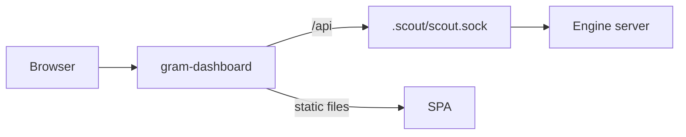
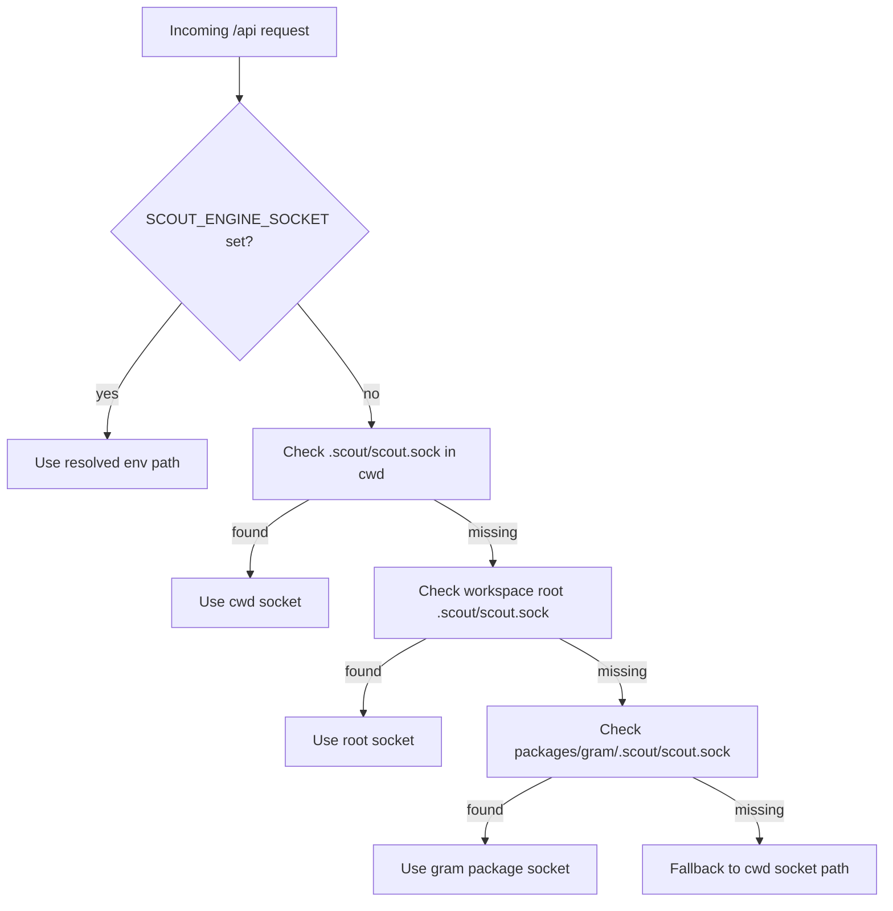

# Grambot dashboard

`gram-dashboard` is a static SPA served by a lightweight Node proxy.
The proxy serves the UI and forwards `/api/*` to the local engine socket.

Default port: `7331`.

## Engine socket resolution

The dashboard proxy prefers an explicit socket override. If none is set, it searches common locations in the
workspace and picks the first socket that exists.

