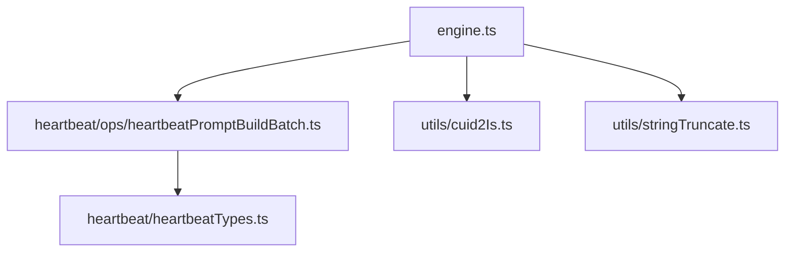

# Engine Heartbeat Prompt and Utils Refactor

Moved the heartbeat batch prompt builder and simple guard helpers into dedicated modules.

```mermaid
flowchart TD
  Engine[engine.ts] --> HeartbeatPrompt[heartbeat/ops/heartbeatPromptBuildBatch.ts]
  Engine --> Cuid2Is[utils/cuid2Is.ts]
  Engine --> StringTruncate[utils/stringTruncate.ts]
  HeartbeatPrompt --> HeartbeatDefinition[heartbeat/heartbeatTypes.ts]
```
