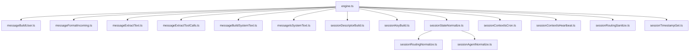

# Engine Message and Session Helper Extraction

Extracted message-formatting helpers and session normalization utilities into dedicated modules for easier reuse and testing.

```mermaid
flowchart TD
  Engine[engine.ts] --> MsgBuild[messageBuildUser.ts]
  Engine --> MsgFormat[messageFormatIncoming.ts]
  Engine --> MsgExtractText[messageExtractText.ts]
  Engine --> MsgExtractTools[messageExtractToolCalls.ts]
  Engine --> MsgSystem[messageBuildSystemText.ts]
  Engine --> MsgIsSystem[messageIsSystemText.ts]
  Engine --> SessBuild[sessionDescriptorBuild.ts]
  Engine --> SessKey[sessionKeyBuild.ts]
  Engine --> SessNormalize[sessionStateNormalize.ts]
  Engine --> SessCron[sessionContextIsCron.ts]
  Engine --> SessHeartbeat[sessionContextIsHeartbeat.ts]
  Engine --> SessRouting[sessionRoutingSanitize.ts]
  Engine --> SessTimestamp[sessionTimestampGet.ts]
  SessNormalize --> SessRoutingNorm[sessionRoutingNormalize.ts]
  SessNormalize --> SessAgentNorm[sessionAgentNormalize.ts]
```
