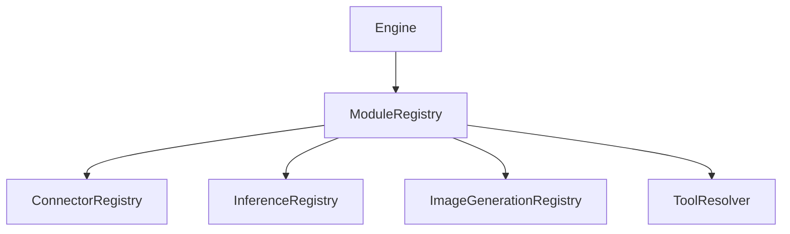

# Engine Modules Registry

The engine module registries now live under `sources/engine/modules/`. `ModuleRegistry` aggregates the registries and is exposed on the engine instance as `modules`.

```mermaid
flowchart TD
  Engine[Engine]
  Registry[ModuleRegistry]
  Connector[ConnectorRegistry]
  Inference[InferenceRegistry]
  Images[ImageGenerationRegistry]
  Tools[ToolResolver]

  Engine --> Registry
  Registry --> Connector
  Registry --> Inference
  Registry --> Images
  Registry --> Tools
```
