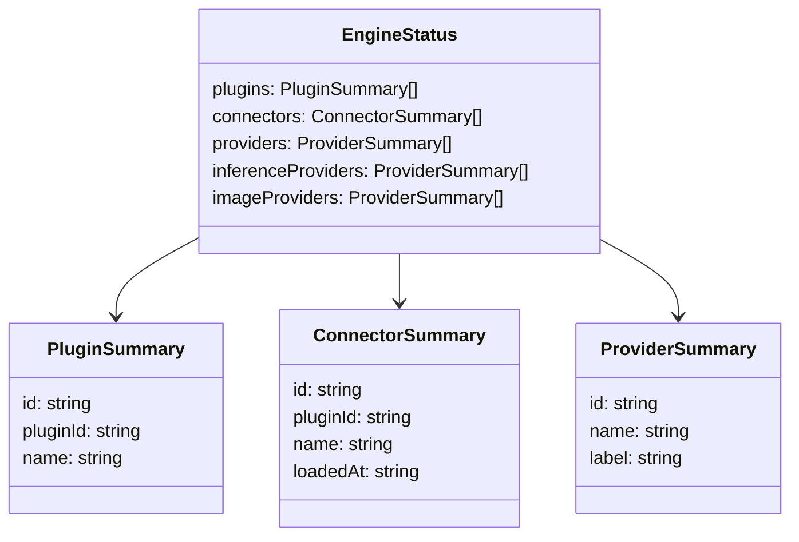
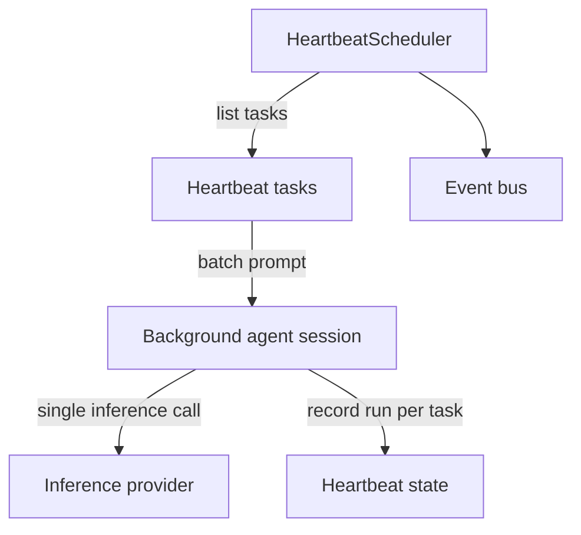
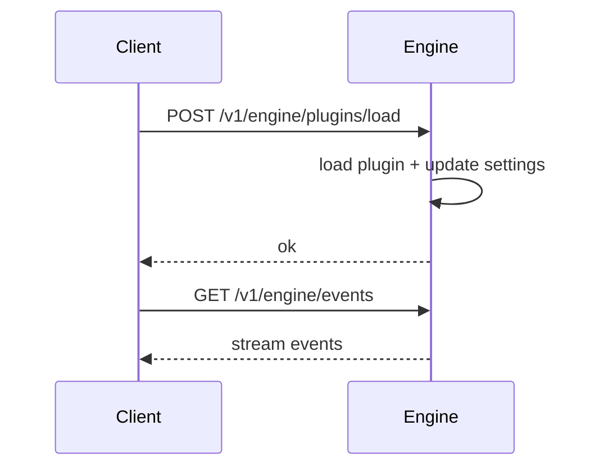
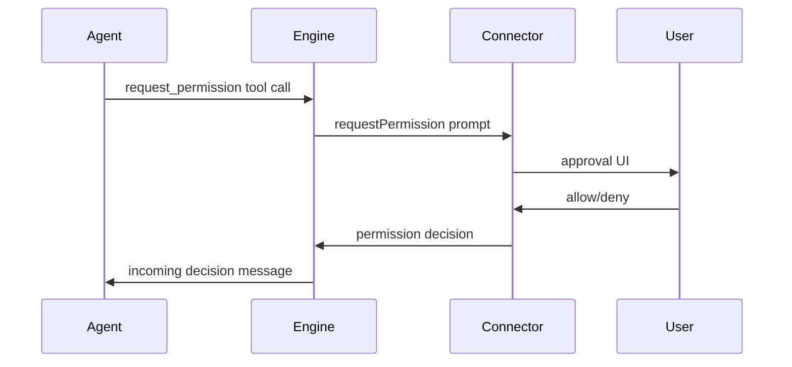

# Engine updates

ClayBot updates engine settings using a three-step strategy:

1. **Local server running**: send a mutation request over the local HTTP socket
   at `.claybot/claybot.sock`.
2. **Local server not running**: write directly to local files
   (settings + auth).
3. **Remote server configured**: reserved for future use.

## Local socket
The `start` command launches a Fastify server bound to a Unix socket.

Current endpoints:
- `GET /v1/engine/status`
- `GET /v1/engine/cron/tasks`
- `GET /v1/engine/sessions`
- `GET /v1/engine/sessions/:storageId`
- `POST /v1/engine/sessions/:storageId/reset`
- `GET /v1/engine/plugins`
- `POST /v1/engine/plugins/load`
- `POST /v1/engine/plugins/unload`
- `POST /v1/engine/auth`
- `GET /v1/engine/events` (SSE)

Plugin mutations accept:
- `POST /v1/engine/plugins/load` payload `{ "pluginId": "...", "instanceId": "...", "settings": { ... } }`
- `POST /v1/engine/plugins/unload` payload `{ "instanceId": "..." }`

## Status payload (named entities)
The status response returns display names alongside ids for use in the dashboard.

## Heartbeat batch execution

Heartbeat tasks are collected and executed as a single background-agent inference call.
`lastRunAt` is tracked as a single global timestamp and applied to each task entry. Each task still emits `heartbeat.task.ran`.

## Permission requests

Permission requests are asynchronous. After a tool call, the engine waits for the connector's decision
before continuing the session.

