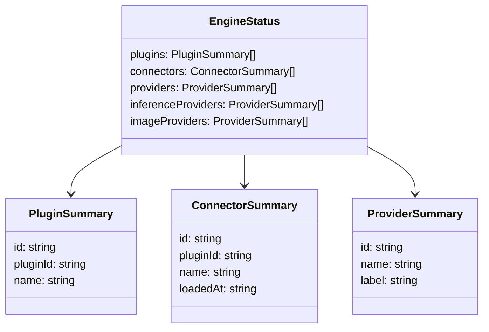
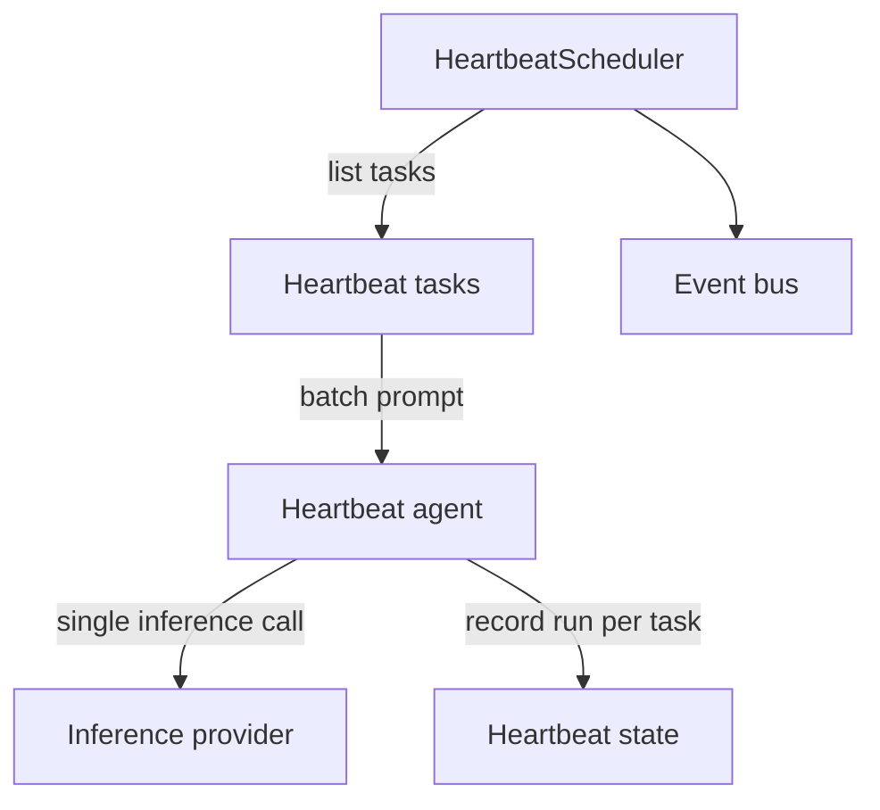
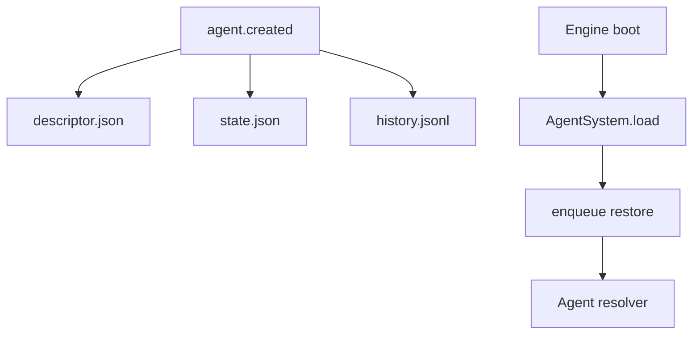
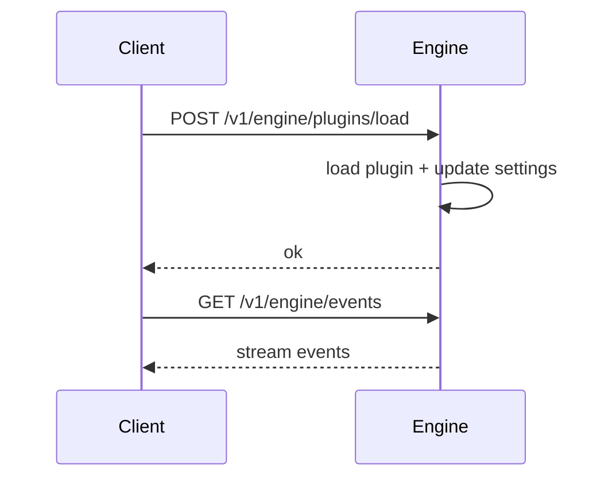
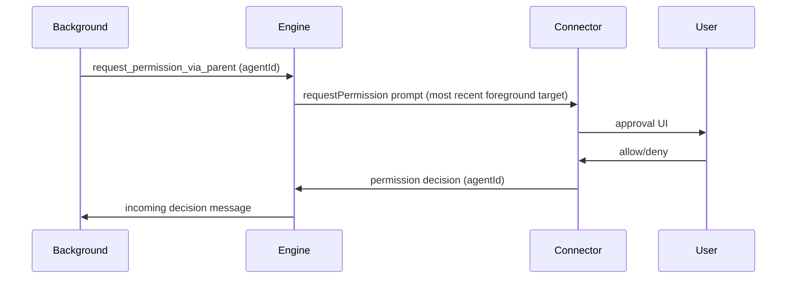

# Engine updates

ClayBot updates engine settings using a three-step strategy:

1. **Local server running**: send a mutation request over the local HTTP socket
   at `.claybot/claybot.sock`.
2. **Local server not running**: write directly to local files
   (settings + auth).
3. **Remote server configured**: reserved for future use.

## Local socket
The `start` command launches a Fastify server bound to a Unix socket.

Current endpoints:
- `GET /v1/engine/status`
- `GET /v1/engine/cron/tasks`
- `GET /v1/engine/heartbeat/tasks`
- `GET /v1/engine/agents`
- `GET /v1/engine/agents/background`
- `GET /v1/engine/agents/:agentId/history`
- `POST /v1/engine/agents/:agentId/reset`
- `GET /v1/engine/plugins`
- `POST /v1/engine/plugins/load`
- `POST /v1/engine/plugins/unload`
- `POST /v1/engine/auth`
- `GET /v1/engine/events` (SSE)

Note: `/v1/engine/agents/background` is derived from persisted agent state and does not
include live inbox status.

Plugin mutations accept:
- `POST /v1/engine/plugins/load` payload `{ "pluginId": "...", "instanceId": "...", "settings": { ... } }`
- `POST /v1/engine/plugins/unload` payload `{ "instanceId": "..." }`

## Status payload (named entities)
The status response returns display names alongside ids for use in the dashboard.

## Heartbeat batch execution

Heartbeat tasks are collected and executed as a single heartbeat inference call.
`lastRunAt` is tracked as a single global timestamp and applied to each task entry. Each task still emits `heartbeat.task.ran`.

## Agent descriptor persistence

Each agent writes `descriptor.json` and `state.json` under `agents/<id>/`. On startup, the engine loads
those files and enqueues a restore message so the agent can rebuild inference context from history.
Fetch strategies are limited to `most-recent-foreground` and `heartbeat`.

## Permission requests

Permission requests are asynchronous. Foreground agents call `request_permission`. Background agents
call `request_permission_via_parent`, which targets the most recent foreground agent and includes the
requesting agent id so the decision can be routed directly.

