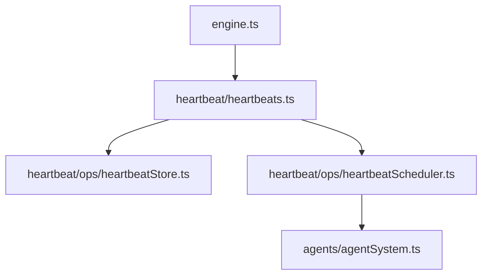

# Heartbeats

Heartbeat prompts are stored on disk and executed as a single batch on a fixed interval.

## Storage

Heartbeat prompts live under `<config>/heartbeat/`:
- `<task-id>.md` - frontmatter + prompt body
- `.heartbeat-state.json` - shared state for last run timestamp

## Execution model

- `Heartbeats` owns storage + scheduling (`HeartbeatStore` + `HeartbeatScheduler`).
- All heartbeat prompts are run together as a single background agent batch.
- The batch is re-run at a fixed interval or when invoked manually.

## Tools

- `heartbeat_add` creates or updates a heartbeat prompt.
- `heartbeat_list` lists available heartbeat prompts.
- `heartbeat_run` runs the batch immediately.
- `heartbeat_remove` deletes a heartbeat prompt.
