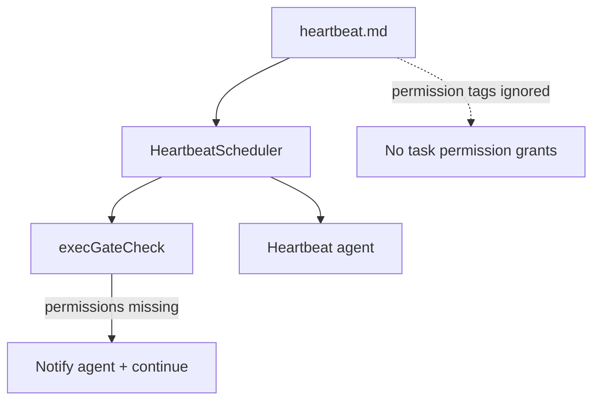

# Heartbeats

Heartbeat prompts are stored on disk and executed as a single batch on a fixed interval.

## Storage

Heartbeat prompts live under `<config>/heartbeat/`:
- `<task-id>.md` - frontmatter + prompt body
- `.heartbeat-state.json` - shared state for last run timestamp

Example heartbeat file:
```markdown
---
title: Check internet
gate:
  command: "curl -fsS https://api.example.com/healthz >/dev/null"
  allowedDomains:
    - api.example.com
---

If the gate command fails, notify that the internet is down.
```

Frontmatter fields:
- `title` (required) - task title
- `gate` (optional) - exec gate config (command + permissions + allowlist) that must succeed to run

## Execution model

- `Heartbeats` owns storage + scheduling (`HeartbeatStore` + `HeartbeatScheduler`).
- All heartbeat prompts are run together as a single background agent batch.
- The batch is re-run at a fixed interval or when invoked manually.
- If a task has a `gate`, it must exit `0` to be included in the batch.

```mermaid
flowchart TD
  Engine[engine.ts] --> Heartbeats[heartbeat/heartbeats.ts]
  Heartbeats --> Store[heartbeat/ops/heartbeatStore.ts]
  Heartbeats --> Scheduler[heartbeat/ops/heartbeatScheduler.ts]
  Scheduler --> Gate[execGateCheck]
  Gate -->|allow| AgentSystem[agents/agentSystem.ts]
  Gate -->|deny (exit != 0)| Skip[Skip task]
  Gate -->|permissions missing| Notify[Notify agent + continue]
```

## Exec Gate

Use `gate` to run a shell command before the LLM and skip work when the check
fails. Exit code `0` means "run"; non-zero means "skip." Trimmed gate output is
appended to the prompt under `[Gate output]`. Gates run with the heartbeat agent
permissions. `gate.permissions` may declare required permission tags. If they are
not already allowed by the heartbeat agent, a system message is posted and the gate
is treated as allowed (the task still runs). Network access requires `@network` plus
`gate.allowedDomains` to allowlist hosts.

## Permissions

Heartbeat tasks do not carry permission tags. Prompts run with the
heartbeat agent's existing permissions only. Any `permissions` entries
in heartbeat files are ignored. `gate.permissions` are validated against
the heartbeat agent's permissions. If they are not already allowed, a system message
is posted and the task runs anyway (the gate is treated as successful).



## Tools

- `heartbeat_add` creates or updates a heartbeat prompt.
- `heartbeat_list` lists available heartbeat prompts.
- `heartbeat_run` runs the batch immediately.
- `heartbeat_remove` deletes a heartbeat prompt.
