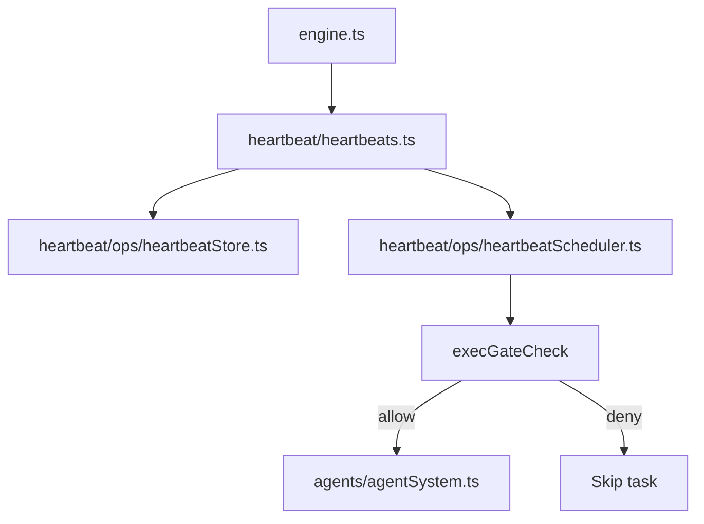

# Heartbeats

Heartbeat prompts are stored on disk and executed as a single batch on a fixed interval.

## Storage

Heartbeat prompts live under `<config>/heartbeat/`:
- `<task-id>.md` - frontmatter + prompt body
- `.heartbeat-state.json` - shared state for last run timestamp

Example heartbeat file:
```markdown
---
title: Check internet
gate:
  command: "curl -fsS https://api.example.com/healthz >/dev/null"
  permissions:
    - "@web"
  allowedDomains:
    - api.example.com
---

If the gate command fails, notify that the internet is down.
```

## Execution model

- `Heartbeats` owns storage + scheduling (`HeartbeatStore` + `HeartbeatScheduler`).
- All heartbeat prompts are run together as a single background agent batch.
- The batch is re-run at a fixed interval or when invoked manually.
- If a task has a `gate`, it must exit `0` to be included in the batch.



## Exec Gate

Use `gate` to run a shell command before the LLM and skip work when the check
fails. Exit code `0` means "run"; non-zero means "skip." Trimmed gate output is
appended to the prompt under `[Gate output]`. Use `gate.permissions` for extra
permissions (`@web`, `@read:/path`, `@write:/path`). Network access requires
`@web` plus `gate.allowedDomains` to allowlist hosts.

## Tools

- `heartbeat_add` creates or updates a heartbeat prompt.
- `heartbeat_list` lists available heartbeat prompts.
- `heartbeat_run` runs the batch immediately.
- `heartbeat_remove` deletes a heartbeat prompt.
