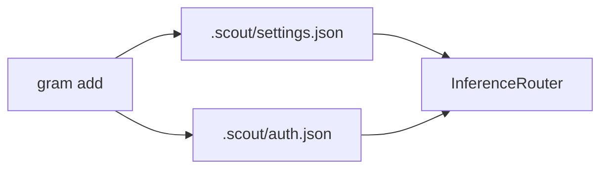
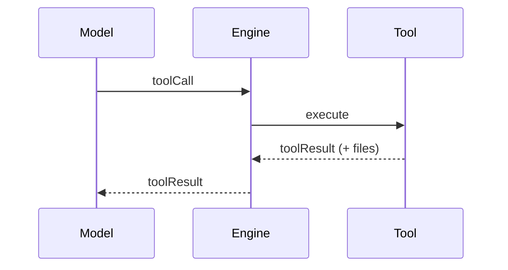
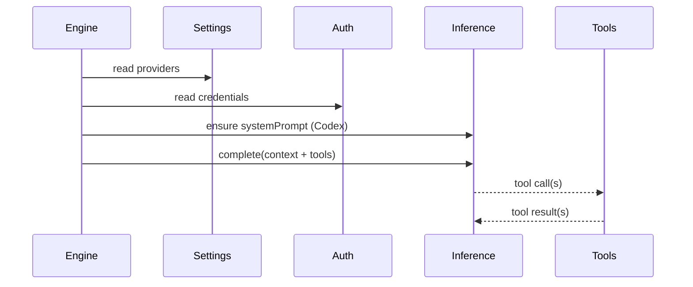

# Inference runtime

Inference is provided by built-in providers. They register with the `InferenceRegistry`,
and the `InferenceRouter` selects them based on `.scout/settings.json`.

## Providers
Configured in settings (in priority order):
```json
{
  "providers": [
    { "id": "openai", "enabled": true, "model": "gpt-4o-mini" }
  ]
}
```

`gram add` stores providers in priority order; disabled providers are skipped.
`gram providers` moves the selected provider to the top of the priority list.



## Tools
Tools are registered dynamically by plugins and core runtime:
- `add_cron` schedules a cron task.
- `memory_search` queries the memory plugin.
- `web_search` (Brave) performs web search.
- `generate_image` uses registered image providers and is only added when one is available.
- `set_reaction` sets connector reactions (Telegram).
- `read` reads a UTF-8 text file from the session workspace or an allowed read directory (path must be absolute and within the allowed read set; large files may be truncated).
- `write` writes UTF-8 text to a file in the session workspace or an allowed write directory, creating parent directories as needed (path must be absolute and within the allowed write set; supports append).
- `edit` applies sequential find/replace edits to a file in the session workspace or an allowed write directory (each edit must match at least once; path must be absolute and within the allowed write set).
- `exec` runs a shell command with the working directory locked to the session workspace (or a subdirectory within it); cwd must be absolute and resolve inside the workspace. Writes are sandboxed to the allowed write set.
- `allow_write` expands the set of absolute directories that shell tools may write to.
- `reset_permissions` clears extra read/write/web permissions back to workspace defaults.
- `request_permission` asks the user to grant a permission like `@write:/path`, `@read:/path`, or `@web` (paths must be absolute).




