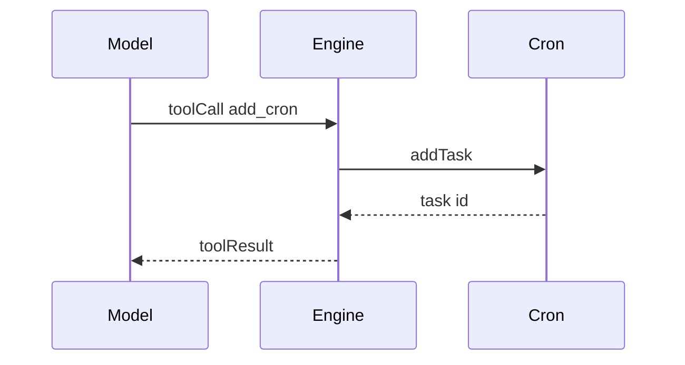
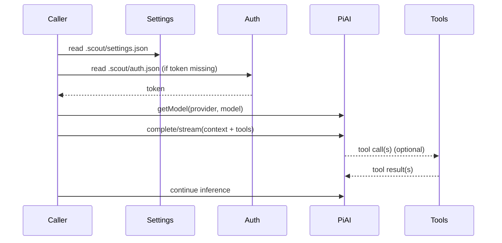

# Inference runtime

Scout ships an inference helper for Codex and Claude Code via `@mariozechner/pi-ai`.

## Exports
- `connectCodex({ model, token? })`
- `connectClaudeCode({ model, token? })`

Each returns an `InferenceClient` with:
- `complete(context, options?)`
- `stream(context, options?)`

## Tools
Scout attaches tool definitions to the inference context and handles tool calls
before sending a final reply.

Current tools:
- `add_cron` schedules a cron task that sends a message back to the active chat.

## Agent priority
Inference agents are read from `.scout/settings.json` under `agents`.
Order is preserved (last added is last), with `main: true` moved to the front.

When handling a session message:
- Scout tries agents in priority order.
- It only falls back if a provider fails before inference starts (e.g., missing token or invalid model).
- If inference has already started and fails, Scout stops and reports the error.
- If the configured model id is missing or invalid, Scout picks a default from the pi-ai model registry
  (prefers `*-latest`, otherwise the first model in the registry).

## Tool calls
Scout exposes tool calls to inference providers.
Currently supported tool:
- `add_cron` schedules a cron task and can immediately respond with a tool result.

