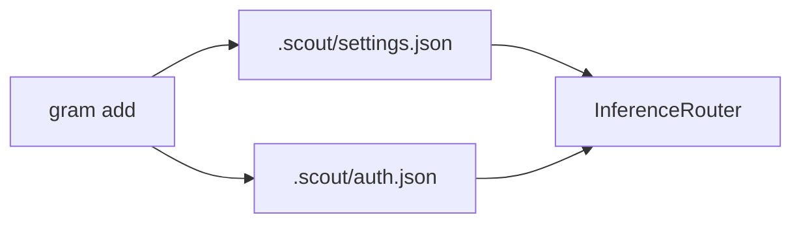
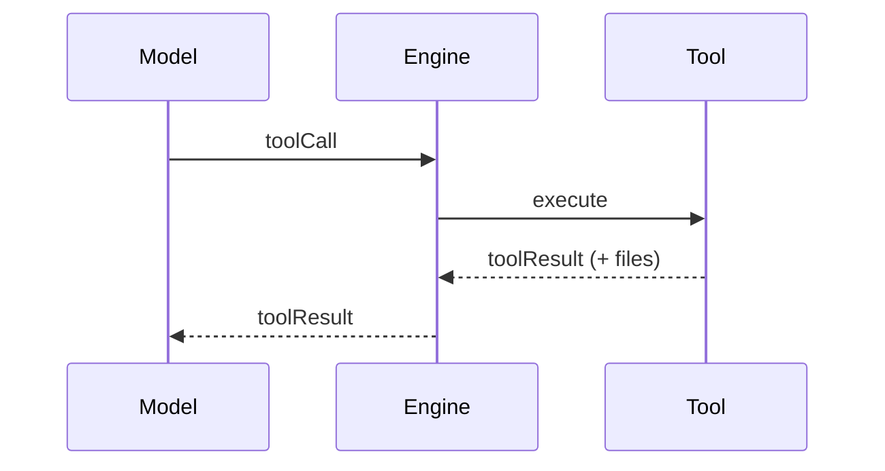
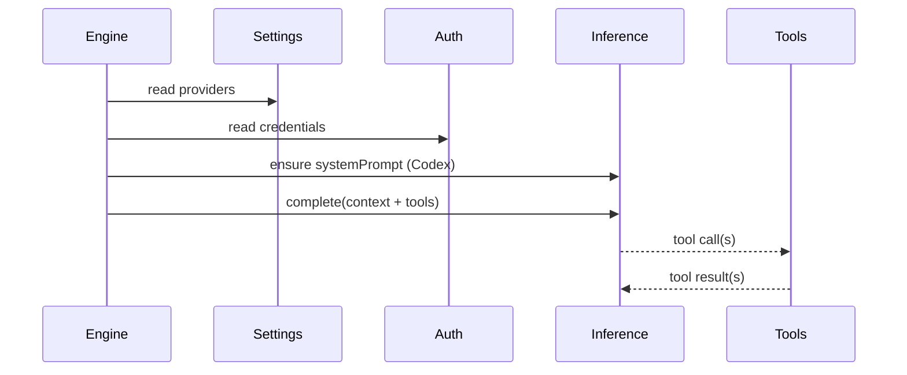

# Inference runtime

Inference is provided by built-in providers. They register with the `InferenceRegistry`,
and the `InferenceRouter` selects them based on `.scout/settings.json`.

## Providers
Configured in settings (in priority order):
```json
{
  "providers": [
    { "id": "openai", "enabled": true, "model": "gpt-4o-mini" }
  ]
}
```

`gram add` stores providers in priority order; disabled providers are skipped.
`gram providers` moves the selected provider to the top of the priority list.



## Tools
Tools are registered dynamically by plugins and core runtime:
- `add_cron` schedules a cron task.
- `memory_search` queries the memory plugin.
- `web_search` (Brave) performs web search.
- `generate_image` uses registered image providers and is only added when one is available.
- `set_reaction` sets connector reactions (Telegram).




