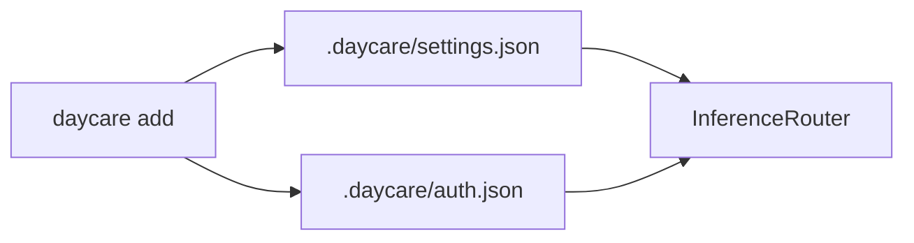
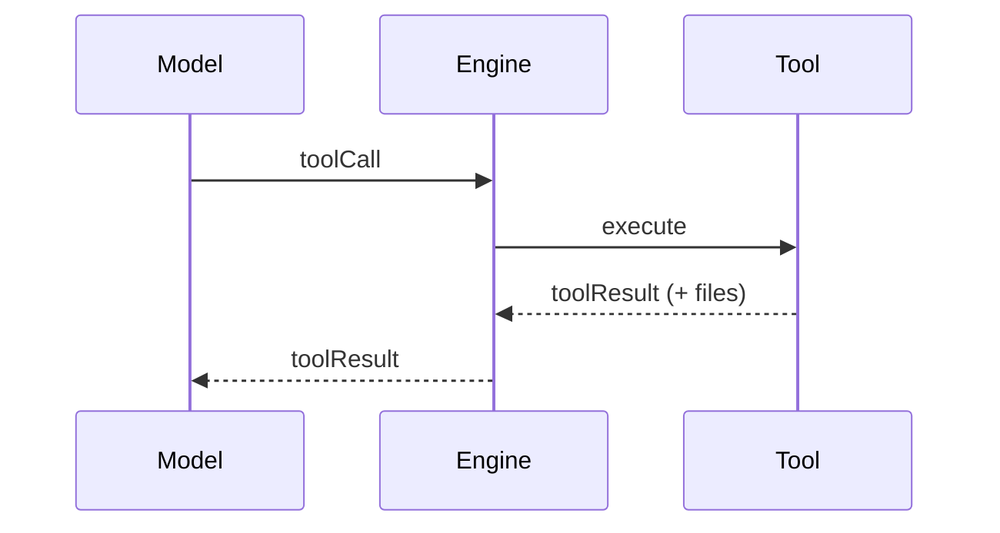
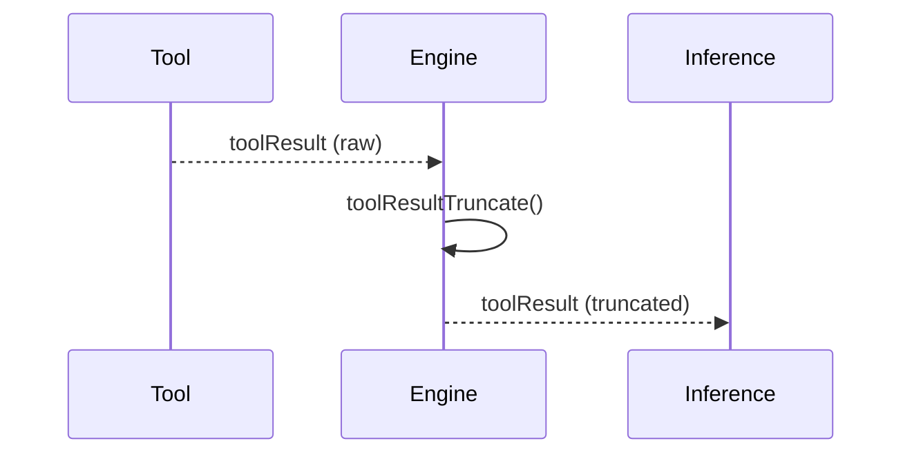
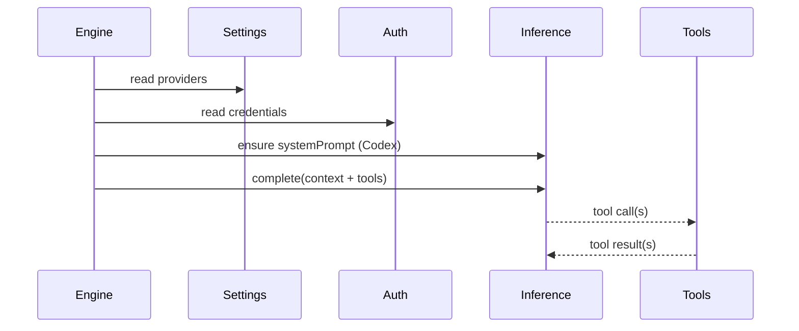

# Inference runtime

Inference is provided by built-in providers. They register with the `InferenceRegistry`,
and the `InferenceRouter` selects them based on `.daycare/settings.json`.

## Providers
Configured in settings (in priority order):
```json
{
  "providers": [
    { "id": "openai", "enabled": true, "model": "gpt-4o-mini" }
  ]
}
```

`daycare add` stores providers in priority order; disabled providers are skipped.
`daycare providers` moves the selected provider to the top of the priority list.



## Tools
Tools are registered dynamically by plugins and core runtime:
- `add_cron` creates a cron task stored in `<config>/cron/`.
- `cron_read_task` reads a cron task description and prompt.
- `cron_read_memory` reads memory for the current cron task.
- `cron_write_memory` updates memory for the current cron task.
- `cron_delete_task` deletes a cron task.
- `memory_create_entity` creates a memory entity (requires name + description).
- `memory_upsert_record` adds or updates a memory record.
- `memory_list_entities` lists entity names + descriptions.
- `web_search` (Brave) performs web search.
- `generate_image` uses registered image providers and is only added when one is available.
- `set_reaction` sets connector reactions (Telegram).
- `read` reads a UTF-8 text file from the agent workspace or an allowed read directory (path must be absolute and within the allowed read set; large files may be truncated). By default, the read set includes the filesystem root.
- `write` writes UTF-8 text to a file in the agent workspace or an allowed write directory, creating parent directories as needed (path must be absolute and within the allowed write set; supports append).
- `edit` applies sequential find/replace edits to a file in the agent workspace or an allowed write directory (each edit must match at least once; path must be absolute and within the allowed write set).
- `exec` runs a shell command with the working directory locked to the agent workspace (or a subdirectory within it); cwd must be absolute and resolve inside the workspace. Writes are sandboxed to the allowed write set.
- `request_permission` asks the user to grant a permission like `@write:/path`, `@read:/path`, or `@network` (paths must be absolute). Background requests are routed through the most recent foreground agent.



## Tool result truncation
Very large tool outputs are truncated before being stored in the inference context.




